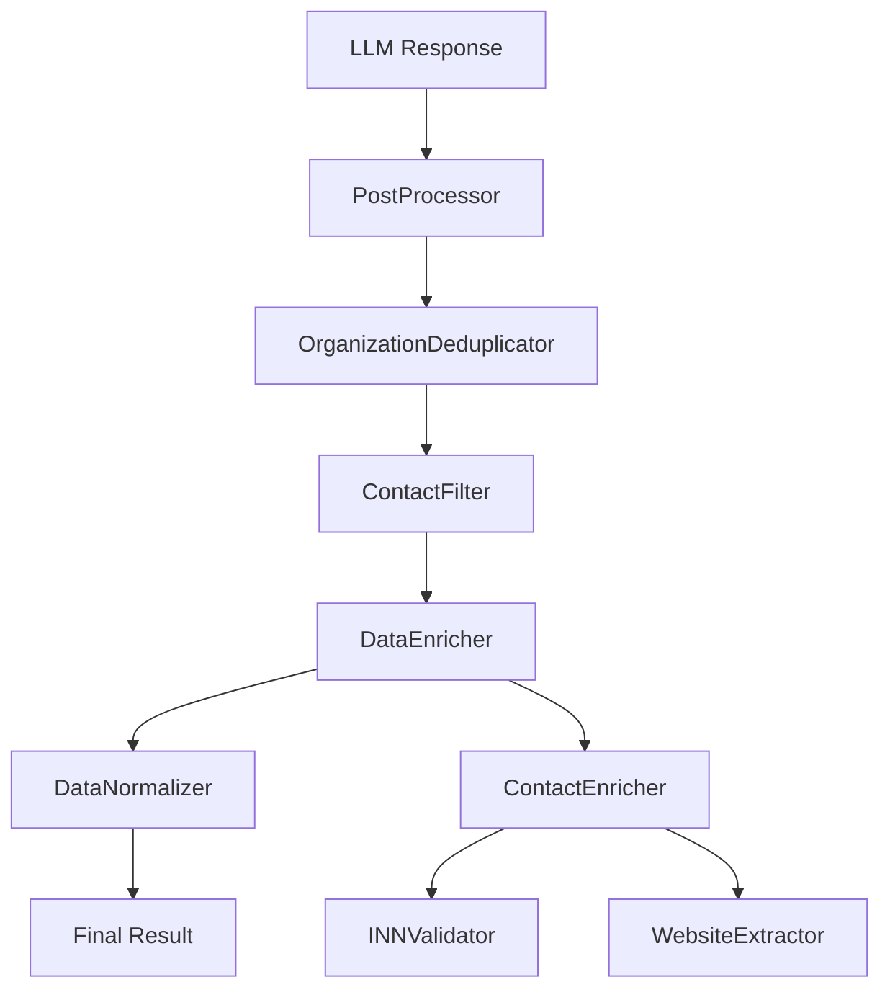

# Документ дизайна

## Обзор

Данный документ описывает техническое решение для исправления трех критических проблем в пайплайне обработки электронной почты:

1. **Неправильная обработка регистра в постобработке** - система принудительно приводит текст к нижнему регистру
2. **Неактивное обогащение данных** - модуль ContactEnricher существует, но не работает корректно
3. **Ошибки валидации** - конкретные письма не проходят валидацию схемы

## Архитектура

### Текущая архитектура постобработки



### Проблемные компоненты

1. **DataNormalizer** - принудительно изменяет регистр текста
2. **OrganizationDeduplicator** - нормализует названия организаций в нижний регистр
3. **AdvancedContactDeduplicator** - нормализует имена в нижний регистр
4. **ContactEnricher** - может не вызываться или работать некорректно

## Компоненты и интерфейсы

### 1. Исправление обработки регистра

#### Проблемные места:
- `src/postprocessing/data_normalizer.py:448` - должности приводятся к `.lower()`
- `src/postprocessing/data_normalizer.py:466` - только `.capitalize()` вместо сохранения исходного регистра
- `src/postprocessing/organization_deduplicator.py:251` - названия организаций в `.lower()`
- `src/postprocessing/advanced_contact_deduplicator.py:399` - имена в `.lower()`

#### Решение:
Создать **CasePreservingNormalizer** с интеллектуальной обработкой регистра:

```python
class CasePreservingNormalizer:
    def __init__(self):
        # Паттерны для сохранения регистра
        self.abbreviation_patterns = [
            r'\b[А-ЯЁ]{2,}\b',  # КДЛ, ОМТС, ООО
            r'\b[A-Z]{2,}\b',   # LLC, INC, CEO
        ]
        self.title_patterns = [
            r'\b[А-ЯЁ][а-яё]+\b',  # Медицина, Заведующая
            r'\b[A-Z][a-z]+\b',    # Manager, Director
        ]
    
    def normalize_preserving_case(self, text: str, field_type: str) -> str:
        """Нормализация с сохранением важного регистра"""
        # Логика сохранения регистра для аббревиатур и названий
        pass
```

### 2. Активация обогащения данных

#### Диагностика проблемы:
ContactEnricher интегрирован в цепочку: `PostProcessor → DataEnricher → ContactEnricher`

#### Возможные причины неработоспособности:
1. **Ошибки в ContactEnricher** - исключения блокируют обогащение
2. **Неправильная конфигурация** - отсутствуют необходимые зависимости
3. **Логирование отключено** - результаты обогащения не видны

#### Решение:
1. **Улучшенное логирование** в ContactEnricher
2. **Graceful degradation** - продолжение работы при ошибках обогащения
3. **Диагностические методы** для проверки статуса обогащения

```python
class EnhancedContactEnricher(ContactEnricher):
    def __init__(self, *args, **kwargs):
        super().__init__(*args, **kwargs)
        self.logger = logging.getLogger(__name__)
        self.stats = {
            'contacts_processed': 0,
            'websites_extracted': 0,
            'inn_validated': 0,
            'errors': 0
        }
    
    def enrich_contacts(self, contacts, email_data=None):
        self.logger.info(f"🔍 Начинаем обогащение {len(contacts)} контактов")
        
        try:
            result = super().enrich_contacts(contacts, email_data)
            self.logger.info(f"✅ Обогащение завершено: {len(result)} контактов")
            return result
        except Exception as e:
            self.logger.error(f"❌ Ошибка обогащения: {e}")
            return contacts  # Возвращаем исходные контакты
```

### 3. Исправление ошибок валидации

#### Диагностический подход:
1. **Анализ конкретной ошибки** в `email_022_20250729_20250729_dna_technology_ru_6360137e`
2. **Улучшенная автокоррекция** в валидаторе
3. **Детальное логирование** ошибок валидации

#### Решение:
Расширить `LLMResponseValidator` с улучшенной автокоррекцией:

```python
class EnhancedLLMResponseValidator(LLMResponseValidator):
    def validate_llm_response(self, response):
        """Валидация с улучшенной автокоррекцией"""
        try:
            return super().validate_llm_response(response)
        except ValidationError as e:
            self.logger.error(f"Ошибка валидации: {e}")
            
            # Попытка автокоррекции
            corrected = self._enhanced_auto_correct(response, e)
            return self.validate_llm_response(corrected)
    
    def _enhanced_auto_correct(self, response, error):
        """Улучшенная автокоррекция с детальным анализом"""
        # Специфические исправления для найденных паттернов ошибок
        pass
```

## Модели данных

### Конфигурация нормализации

```python
@dataclass
class NormalizationConfig:
    preserve_abbreviations: bool = True
    preserve_titles: bool = True
    preserve_organization_names: bool = True
    preserve_positions: bool = True
    
    # Паттерны для сохранения регистра
    abbreviation_patterns: List[str] = field(default_factory=list)
    title_patterns: List[str] = field(default_factory=list)
```

### Статистика обогащения

```python
@dataclass
class EnrichmentStats:
    contacts_processed: int = 0
    websites_extracted: int = 0
    inn_validated: int = 0
    errors: int = 0
    processing_time: float = 0.0
    
    def to_dict(self) -> Dict[str, Any]:
        return asdict(self)
```

## Обработка ошибок

### Стратегия Graceful Degradation

1. **Обогащение данных**: При ошибке возвращать исходные контакты
2. **Нормализация регистра**: При ошибке сохранять исходный текст
3. **Валидация**: При критических ошибках использовать fallback схему

### Логирование ошибок

```python
class ErrorHandler:
    def __init__(self, logger):
        self.logger = logger
        self.error_stats = defaultdict(int)
    
    def handle_enrichment_error(self, error, contact):
        self.logger.error(f"Ошибка обогащения контакта {contact.get('name', 'Unknown')}: {error}")
        self.error_stats['enrichment_errors'] += 1
    
    def handle_validation_error(self, error, email_id):
        self.logger.error(f"Ошибка валидации письма {email_id}: {error}")
        self.error_stats['validation_errors'] += 1
```

## Стратегия тестирования

### 1. Модульные тесты

- **CasePreservingNormalizer** - тесты сохранения регистра для различных паттернов
- **EnhancedContactEnricher** - тесты обогащения с мокированием внешних зависимостей
- **EnhancedLLMResponseValidator** - тесты автокоррекции валидации

### 2. Интеграционные тесты

- **Полный пайплайн постобработки** с реальными данными
- **Тестирование на проблемных письмах** включая `email_022`
- **Регрессионные тесты** для предотвращения повторных проблем

### 3. Тестовые данные

```python
TEST_CASES = {
    'case_preservation': [
        {'input': 'КДЛ', 'expected': 'КДЛ'},
        {'input': 'Медицина', 'expected': 'Медицина'},
        {'input': 'Заведующая', 'expected': 'Заведующая'},
    ],
    'enrichment': [
        {'email': 'sklad@centerld.ru', 'expected_website': 'centerld.ru'},
    ],
    'validation': [
        {'file': 'email_022_20250729_20250729_dna_technology_ru_6360137e'},
    ]
}
```

## План развертывания

### Этап 1: Исправление регистра
1. Создать `CasePreservingNormalizer`
2. Интегрировать в `DataNormalizer`
3. Обновить `OrganizationDeduplicator` и `AdvancedContactDeduplicator`
4. Тестирование на проблемных примерах

### Этап 2: Активация обогащения
1. Добавить детальное логирование в `ContactEnricher`
2. Реализовать `EnhancedContactEnricher`
3. Диагностировать и исправить проблемы обогащения
4. Проверить работу на примере `sklad@centerld.ru`

### Этап 3: Исправление валидации
1. Проанализировать ошибку в `email_022`
2. Расширить автокоррекцию в валидаторе
3. Добавить специфические исправления для найденных паттернов
4. Тестирование на всех проблемных письмах

### Этап 4: Интеграция и тестирование
1. Интегрировать все исправления
2. Запустить полные интеграционные тесты
3. Проверить на реальных данных из первых 10 писем
4. Мониторинг и оптимизация производительности