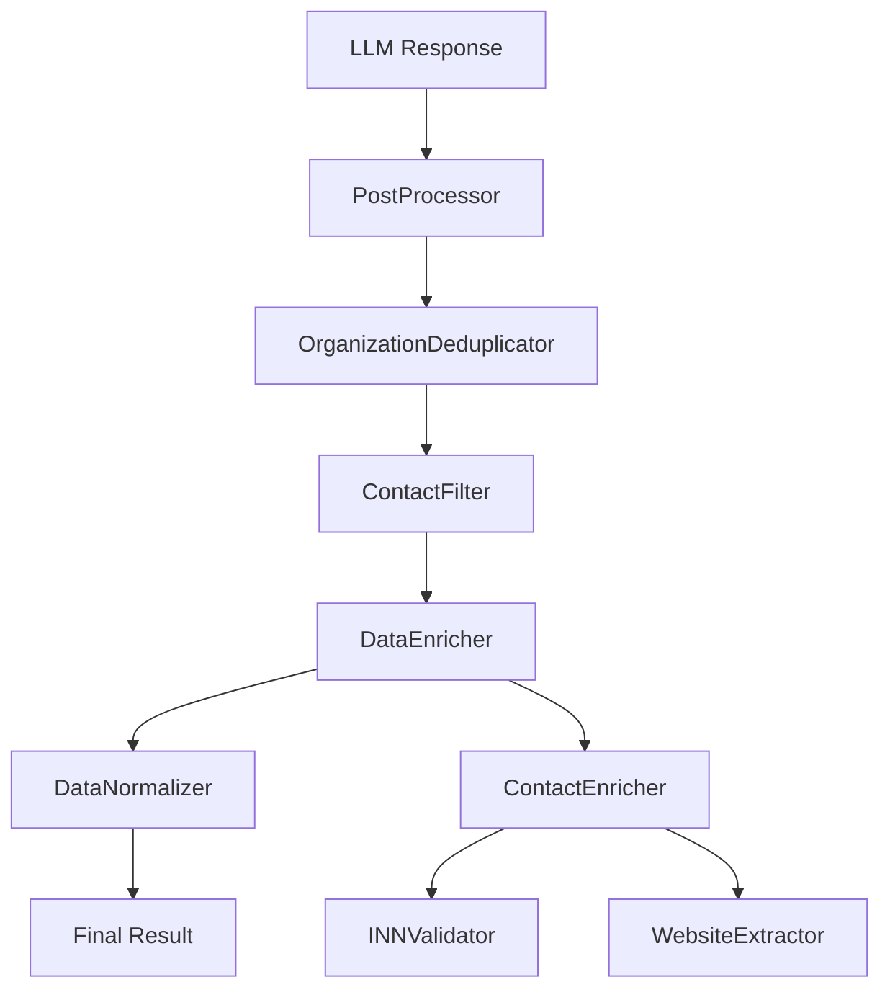

# Документ дизайна

## Обзор

Данный документ описывает техническое решение для исправления трех критических проблем в пайплайне обработки электронной почты:

1. **Неправильная нормализация регистра в постобработке** - система неправильно применяет `.capitalize()` и `.lower()`, ломая аббревиатуры и правильное форматирование
2. **Проблемы с обогащением данных** - модуль ContactEnricher работает нестабильно или не обогащает данные как ожидается
3. **Ошибки валидации** - конкретные письма не проходят валидацию схемы

Основная проблема выявлена в результате анализа: система должна нормализовать только первое слово (делать заглавной первую букву), а остальные слова оставлять в исходном регистре из raw JSON.

## Архитектура

### Текущая архитектура постобработки



### Проблемные компоненты

Анализ результатов показал конкретные проблемы:

1. **DataNormalizer** - использует `.capitalize()` что превращает "Руководитель ОМТС" в "Руководитель омтс"
2. **OrganizationDeduplicator** - использует `.lower()` что ломает названия организаций
3. **AdvancedContactDeduplicator** - использует `.lower()` что ломает имена контактов
4. **ContactEnricher** - работает нестабильно, не всегда обогащает email → website

### Примеры проблем

**Должности сейчас:**
- "Заведующая Клинико-Диагностической Лабораторией" (все слова с большой буквы)
- "Ведущий Специалист По Проектам Группы КДЛ" (неправильная капитализация)

**Должности как должно быть:**
- "Заведующая клинико-диагностической лабораторией" (только первое слово)
- "Ведущий специалист по проектам Группы КДЛ" (сохранены аббревиатуры)

**Организации сейчас:**
- "Центр Специализированной Медицинской Помощи" (все слова с большой буквы)

**Организации как должно быть:**
- "Центр специализированной медицинской помощи" (только первое слово)

## Компоненты и интерфейсы

### 1. Исправление нормализации регистра

#### Проблемные места:
- `src/postprocessing/data_normalizer.py` - методы `_normalize_position` и `_normalize_organization_name` используют `.capitalize()`
- `src/postprocessing/organization_deduplicator.py` - метод `_normalize_organization_name` использует `.lower()`
- `src/postprocessing/advanced_contact_deduplicator.py` - метод `_normalize_name` использует `.lower()`

#### Решение:
Создать простую функцию **normalize_first_word_only** которая правильно нормализует текст:

```python
def normalize_first_word_only(text: str) -> str:
    """
    Нормализует только первое слово - делает заглавной первую букву.
    Остальные слова остаются в исходном регистре.
    
    Примеры:
    - "руководитель ОМТС" → "Руководитель ОМТС"
    - "заведующая клинико-диагностической лабораторией" → "Заведующая клинико-диагностической лабораторией"
    - "центр специализированной медицинской помощи" → "Центр специализированной медицинской помощи"
    """
    if not text or not text.strip():
        return text
    
    text = text.strip()
    
    # Специальная обработка для текста в кавычках
    if text.startswith('"') and text.endswith('"'):
        # Для текста в кавычках нормализуем только содержимое
        inner_text = text[1:-1]
        if inner_text:
            normalized_inner = inner_text[0].upper() + inner_text[1:] if len(inner_text) > 1 else inner_text.upper()
            return f'"{normalized_inner}"'
        return text
    
    # Обычная нормализация - только первая буква заглавная
    return text[0].upper() + text[1:] if len(text) > 1 else text.upper()
```

#### Интеграция в существующие компоненты:

1. **DataNormalizer**: заменить `.capitalize()` на `normalize_first_word_only()`
2. **OrganizationDeduplicator**: заменить `.lower()` на `normalize_first_word_only()` для отображения, использовать `.lower()` только для сравнения
3. **AdvancedContactDeduplicator**: аналогично - разделить нормализацию для отображения и для сравнения

### 2. Исправление логики обогащения данных

#### Анализ проблем:
Диагностика показала критические проблемы с текущим обогащением:

1. **Обогащение публичными провайдерами:**
   - `086975@bk.ru` → `https://www.bk.ru` ❌ (банк, не связан с контактом)
   - `medic.81@mail.ru` → должен НЕ обогащаться mail.ru

2. **Перекрестное обогащение между организациями:**
   - Пименова Юлия (organization_id: 2, email: medic.81@mail.ru)
   - Обогащена сайтом `https://www.dna-technology.ru` (organization_id: 1) ❌

#### Решение:
Создать **SmartContactEnricher** с правильной логикой:

```python
class SmartContactEnricher:
    def __init__(self):
        # Список публичных email провайдеров для исключения
        self.public_email_providers = {
            'mail.ru', 'yandex.ru', 'gmail.com', 'yahoo.com',
            'bk.ru', 'rambler.ru', 'inbox.ru', 'list.ru',
            'hotmail.com', 'outlook.com', 'live.com'
        }
    
    def should_enrich_contact(self, contact, organizations):
        """Определяет нужно ли обогащать контакт"""
        email = contact.get('email')
        if not email:
            return False, "Нет email"
        
        domain = self._extract_domain(email)
        if not domain:
            return False, "Не удалось извлечь домен"
        
        # Исключаем публичные провайдеры
        if domain in self.public_email_providers:
            return False, f"Публичный провайдер: {domain}"
        
        # Проверяем соответствие организации
        org_id = contact.get('organization_id')
        if org_id and org_id in organizations:
            org = organizations[org_id]
            org_website = org.get('website', '').replace('https://', '').replace('http://', '').replace('www.', '')
            
            if org_website and domain != org_website:
                return False, f"Домен {domain} не соответствует организации {org_website}"
        
        return True, f"Корпоративный email: {domain}"
    
    def enrich_contacts(self, contacts, organizations, email_data=None):
        """Умное обогащение контактов"""
        enriched = []
        
        for contact in contacts:
            enriched_contact = contact.copy()
            
            should_enrich, reason = self.should_enrich_contact(contact, organizations)
            
            if should_enrich:
                website = self._get_website_for_domain(self._extract_domain(contact['email']))
                if website:
                    enriched_contact['website'] = website
                    enriched_contact['website_confidence'] = 0.8
                    enriched_contact['website_source'] = 'corporate_email'
                    enriched_contact['enrichment_reason'] = reason
            else:
                enriched_contact['enrichment_skipped'] = True
                enriched_contact['enrichment_reason'] = reason
            
            enriched.append(enriched_contact)
        
        return enriched
```

### 3. Система обеспечения 100% стабильности обработки

#### Анализ проблемы:
Текущая система создает файлы с ошибками:
- `email_014_20250729_20250729_millab_ru_62cf1268_20250929_235453_235805_processed.json`
- Содержит: `"validation_error": true`, `"success": false`
- Ошибка: `"unsupported operand type(s) for *: 'NoneType' and 'float'"`

#### Проблемы текущего подхода:
1. **Файлы с ошибками остаются в результатах** - неприемлемо
2. **Нет повторной обработки** проблемных писем
3. **Нет fallback стратегии** для критических ошибок
4. **Пользователь не видит проблемы** по названию файла

#### Решение:
Создать **ResilientEmailProcessor** с механизмом повторной обработки:

```python
class ResilientEmailProcessor:
    def __init__(self, max_retries=3):
        self.max_retries = max_retries
        self.failed_emails = []
        self.retry_strategies = [
            'standard_processing',
            'simplified_processing', 
            'fallback_processing'
        ]
    
    def process_emails_with_retry(self, emails):
        """Обработка писем с повторными попытками"""
        results = []
        failed_emails = []
        
        # Первичная обработка
        for email in emails:
            result = self._process_single_email(email)
            if result['success']:
                results.append(result)
            else:
                failed_emails.append((email, result['error']))
        
        # Повторная обработка проблемных писем
        if failed_emails:
            self.logger.warning(f"🔄 Повторная обработка {len(failed_emails)} проблемных писем")
            
            for email, original_error in failed_emails:
                retry_result = self._retry_email_processing(email, original_error)
                if retry_result['success']:
                    results.append(retry_result)
                    # Перезаписываем проблемные файлы
                    self._overwrite_error_files(email, retry_result)
                else:
                    # Применяем fallback
                    fallback_result = self._create_fallback_result(email, original_error)
                    results.append(fallback_result)
                    self._overwrite_error_files(email, fallback_result)
        
        return results
    
    def _retry_email_processing(self, email, original_error):
        """Повторная обработка письма с разными стратегиями"""
        for strategy in self.retry_strategies:
            try:
                result = self._process_with_strategy(email, strategy)
                if result['success']:
                    self.logger.info(f"✅ Письмо обработано со стратегией {strategy}")
                    return result
            except Exception as e:
                self.logger.warning(f"⚠️ Стратегия {strategy} не сработала: {e}")
                continue
        
        return {'success': False, 'error': 'all_strategies_failed'}
    
    def _create_fallback_result(self, email, error):
        """Создание fallback результата с базовой структурой"""
        return {
            'success': True,  # Помечаем как успешный
            'organizations': [],
            'contacts': [],
            'business_context': 'Письмо обработано с fallback стратегией',
            'summary': {
                'topic': 'Обработка с ограниченной функциональностью',
                'product_interest': None,
                'communication_stage': 'processed_with_fallback',
                'request_type': 'fallback'
            },
            'key_points': ['Письмо обработано с базовой структурой'],
            'commercial_offers': [],
            'interactions': [],
            'processing_note': f'Использована fallback стратегия из-за ошибки: {error}'
        }
```

## Модели данных

### Конфигурация нормализации

```python
@dataclass
class NormalizationConfig:
    # Простая конфигурация для новой логики нормализации
    normalize_first_word_only: bool = True
    preserve_quoted_text: bool = True
    
    # Для отладки и тестирования
    log_normalization_changes: bool = False
```

### Статистика обогащения и нормализации

```python
@dataclass
class ProcessingStats:
    # Статистика нормализации
    positions_normalized: int = 0
    organizations_normalized: int = 0
    normalization_changes: List[Dict[str, str]] = field(default_factory=list)
    
    # Статистика обогащения
    contacts_processed: int = 0
    websites_extracted: int = 0
    inn_validated: int = 0
    enrichment_errors: int = 0
    
    # Общая статистика
    processing_time: float = 0.0
    
    def add_normalization_change(self, field_type: str, original: str, normalized: str):
        if original != normalized:
            self.normalization_changes.append({
                'field_type': field_type,
                'original': original,
                'normalized': normalized
            })
    
    def to_dict(self) -> Dict[str, Any]:
        return asdict(self)
```

## Обработка ошибок

### Стратегия Graceful Degradation

1. **Обогащение данных**: При ошибке возвращать исходные контакты
2. **Нормализация регистра**: При ошибке сохранять исходный текст
3. **Валидация**: При критических ошибках использовать fallback схему

### Логирование ошибок

```python
class ErrorHandler:
    def __init__(self, logger):
        self.logger = logger
        self.error_stats = defaultdict(int)
    
    def handle_enrichment_error(self, error, contact):
        self.logger.error(f"Ошибка обогащения контакта {contact.get('name', 'Unknown')}: {error}")
        self.error_stats['enrichment_errors'] += 1
    
    def handle_validation_error(self, error, email_id):
        self.logger.error(f"Ошибка валидации письма {email_id}: {error}")
        self.error_stats['validation_errors'] += 1
```

## Стратегия тестирования

### 1. Модульные тесты

- **CasePreservingNormalizer** - тесты сохранения регистра для различных паттернов
- **EnhancedContactEnricher** - тесты обогащения с мокированием внешних зависимостей
- **EnhancedLLMResponseValidator** - тесты автокоррекции валидации

### 2. Интеграционные тесты

- **Полный пайплайн постобработки** с реальными данными
- **Тестирование на проблемных письмах** включая `email_022`
- **Регрессионные тесты** для предотвращения повторных проблем

### 3. Тестовые данные

```python
TEST_CASES = {
    'normalization': [
        # Должности
        {'input': 'руководитель ОМТС', 'expected': 'Руководитель ОМТС'},
        {'input': 'заведующая клинико-диагностической лабораторией', 'expected': 'Заведующая клинико-диагностической лабораторией'},
        {'input': 'ведущий специалист по проектам Группы КДЛ Департамента продаж «Медицина»', 'expected': 'Ведущий специалист по проектам Группы КДЛ Департамента продаж «Медицина»'},
        {'input': 'зам. начальника отдела продаж', 'expected': 'Зам. начальника отдела продаж'},
        {'input': 'менеджер отдела "Оборудование для микробиологии и биотехнологий"', 'expected': 'Менеджер отдела "Оборудование для микробиологии и биотехнологий"'},
        {'input': 'специалист компании ООО "Агрохим"', 'expected': 'Специалист компании ООО "Агрохим"'},
        
        # Организации
        {'input': 'центр специализированной медицинской помощи детям имени В.Ф. Войно-Ясенецкого', 'expected': 'Центр специализированной медицинской помощи детям имени В.Ф. Войно-Ясенецкого'},
        {'input': 'ФБУЗ "Центр Гигиены и Эпидемиологии в Республике Хакасия"', 'expected': 'ФБУЗ "Центр Гигиены и Эпидемиологии в Республике Хакасия"'},
    ],
    'enrichment': [
        {'email': 'sklad@centerld.ru', 'expected_website': 'centerld.ru'},
    ],
    'validation': [
        {'file': 'email_022_20250729_20250729_dna_technology_ru_6360137e'},
    ]
}
```

## План развертывания

### Этап 1: Исправление нормализации регистра
1. Создать функцию `normalize_first_word_only`
2. Интегрировать в `DataNormalizer` - заменить `.capitalize()` на новую функцию
3. Обновить `OrganizationDeduplicator` и `AdvancedContactDeduplicator` - разделить нормализацию для отображения и сравнения
4. Тестирование на конкретных примерах: "ОМТС" должен остаться "ОМТС"

### Этап 2: Диагностика и исправление обогащения
1. Создать диагностический инструмент для анализа работы `ContactEnricher`
2. Проанализировать почему `sklad@centerld.ru` не всегда обогащается сайтом `centerld.ru`
3. Исправить найденные проблемы в логике обогащения
4. Добавить стабильное логирование процесса обогащения

### Этап 3: Исправление валидации
1. Проанализировать ошибку в `email_022` (это email_022_20250729_20250729_dna_technology_ru_6360137e)
2. Расширить автокоррекцию в валидаторе для найденных паттернов ошибок
3. Добавить graceful degradation для критических ошибок валидации
4. Тестирование на всех проблемных письмах

### Этап 4: Интеграция и финальное тестирование
1. Интегрировать все исправления в единый пайплайн
2. Запустить тесты на первых 10 письмах с проверкой:
   - "Руководитель ОМТС" остается "Руководитель ОМТС"
   - `sklad@centerld.ru` обогащается сайтом `centerld.ru`
   - `email_022` проходит валидацию без ошибок
3. Мониторинг статистики нормализации и обогащения
4. Оптимизация производительности при необходимости