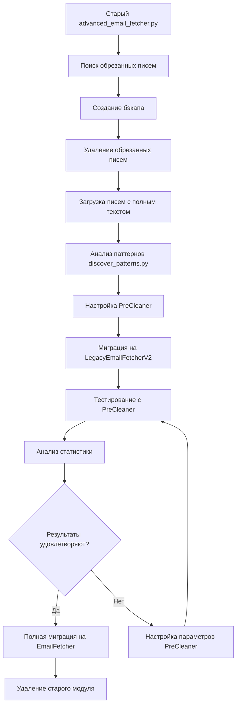

# Финальное руководство по миграции на PreCleaner с новым Email Fetcher

## 🎯 Цель миграции

Переход с монолитного `advanced_email_fetcher.py` на новую модульную архитектуру `src/fetcher` с интегрированным PreCleaner для интеллектуальной очистки текстов писем.

## 📋 Проверка готовности

### ✅ Что уже готово:
- [x] Новая модульная архитектура Email Fetcher в `src/fetcher/`
- [x] PreCleaner адаптер с кэшированием паттернов
- [x] Скрипты поиска и миграции обрезанных писем
- [x] Система статистики эффективности
- [x] Интегрированный текстовый очиститель

### 🔧 Что нужно подготовить:
- [ ] Резервные копии данных
- [ ] Настройки IMAP подключения
- [ ] Выбор стратегии миграции

## 🗺️ Карта миграции



## 📅 Пошаговый план миграции

### Этап 1: Подготовка (15 минут)

```bash
# 1. Создаем полную резервную копию
BACKUP_DATE=$(date +%Y%m%d_%H%M%S)
cp -r data/ data_backup_${BACKUP_DATE}
cp src/advanced_email_fetcher.py src/advanced_email_fetcher.py.backup_${BACKUP_DATE}

echo "Бэкап создан: data_backup_${BACKUP_DATE}"
```

```bash
# 2. Проверяем наличие нового модуля
python -c "
try:
    from src.fetcher import LegacyEmailFetcherV2
    print('✅ Новый Email Fetcher доступен')
except ImportError as e:
    print(f'❌ Ошибка импорта: {e}')
    exit(1)
"
```

### Этап 2: Аудит обрезанных писем (10 минут)

```bash
# 1. Ищем письма с обрезанным текстом
python src/fetcher/utils/find_truncated_emails.py --verbose

# 2. Проверяем отчет
cat data/reports/truncated_emails_*.md
```

**Ожидаемый результат:** Отчет с количеством обрезанных писем и их списком.

### Этап 3: Миграция обрезанных писем (20 минут)

```bash
# Запускаем CLI утилиту миграции
python src/fetcher/utils/migrate_truncated_emails.py
```

**В CLI меню:**
1. Выберите пункт "1. Найти обрезанные письма"
2. Выберите пункт "2. Создать бэкап" (подтвердите)
3. Выберите пункт "3. Удалить обрезанные письма" (подтвердите)
4. Выберите пункт "4. Выход"

### Этап 4: Загрузка писем с полным текстом (30 минут)

```bash
# Создаем скрипт для загрузки удаленных писем с новым Email Fetcher
cat > reload_deleted_emails.py << 'EOF'
import logging
from datetime import datetime, timedelta
from src.fetcher import LegacyEmailFetcherV2

logging.basicConfig(level=logging.INFO)
logger = logging.getLogger(__name__)

def reload_deleted_emails():
    """Загружает удаленные письма с полным текстом"""
    print("🔄 Загрузка писем с полным текстом...")
    
    fetcher = LegacyEmailFetcherV2(logger)
    
    try:
        if fetcher.connect():
            # Загружаем письма за последние 7 дней (или нужный период)
            end_date = datetime.now()
            start_date = end_date - timedelta(days=7)
            
            print(f"📅 Период загрузки: {start_date.date()} - {end_date.date()}")
            
            emails = fetcher.fetch_emails_by_date_range(start_date, end_date)
            
            print(f"✅ Загружено {len(emails)} писем")
            
            # Проверяем длину текстов
            long_texts = 0
            for email in emails:
                body_len = len(email.get('body', ''))
                if body_len > 50000:  # Более 50К символов
                    long_texts += 1
            
            print(f"📊 Статистика:")
            print(f"   - Всего писем: {len(emails)}")
            print(f"   - Длинных текстов (>50К): {long_texts}")
            print(f"   - Процент длинных: {long_texts/len(emails)*100:.1f}%" if emails else "0%")
            
            if long_texts > 0:
                print("✅ Письма загружаются с полным текстом")
            else:
                print("⚠️ Возможны проблемы с загрузкой полных текстов")
            
            fetcher.close()
            return True
            
    except Exception as e:
        print(f"❌ Ошибка: {e}")
        logger.error(f"Ошибка при загрузке писем: {e}", exc_info=True)
        return False

if __name__ == "__main__":
    success = reload_deleted_emails()
    if success:
        print("🎉 Загрузка завершена успешно!")
    else:
        print("❌ Загрузка не удалась")
EOF

# Запускаем загрузку писем
python reload_deleted_emails.py
```

**Важные замечания:**
- Новый Email Fetcher загружает письма БЕЗ обрезки текста
- Проверьте, что длина текстов значительно больше 10,000 символов
- При необходимости измените период загрузки в скрипте
- После эксперимента перенесите вспомогательные скрипты (`reload_deleted_emails.py` и другие) в `scripts/` или удалите их, чтобы не засорять корень репозитория

### Этап 4.1: Проверка корректности вложений (10 минут)

```bash
# Быстрая проверка, что вложения маппятся по message_id
python - <<'PY'
import json
from pathlib import Path
from src.fetcher.attachments.attachment_registry import AttachmentRegistry

emails_root = Path('data/emails')
registry = AttachmentRegistry(logger=None)

for date_dir in sorted(emails_root.iterdir()):
    if not date_dir.is_dir():
        continue
    json_files = list(date_dir.glob('*.json'))
    if not json_files:
        continue
    sample = json.loads(json_files[0].read_text())
    attachments = registry.get_attachments_for_message(sample['message_id'], date_dir.name)
    print(f"{sample['message_id']} → {len(attachments)} файлов из реестра / {len(sample.get('attachments', []))} в JSON")
    break
PY
```

**Цель:** убедиться, что `message_id` корректно связывает письма и их файлы. При расхождениях повторите загрузку для проблемных писем и убедитесь, что старые артефакты удалены.

### Этап 5: Анализ паттернов (30 минут)

```bash
# 1. Конвертируем письма в NDJSON формат
python -c "
import json
from pathlib import Path
from datetime import datetime, timedelta

def convert_json_to_ndjson(emails_dir, output_file):
    emails_dir = Path(emails_dir)
    output_file = Path(output_file)
    
    with open(output_file, 'w', encoding='utf-8') as outfile:
        for json_file in emails_dir.glob('*.json'):
            try:
                with open(json_file, 'r', encoding='utf-8') as infile:
                    email_data = json.load(infile)
                    
                    email_ndjson = {
                        'message_id': email_data.get('message_id', ''),
                        'thread_id': email_data.get('thread_id', ''),
                        'from': email_data.get('from', ''),
                        'date': email_data.get('date', ''),
                        'body_text': email_data.get('body', '')
                    }
                    outfile.write(json.dumps(email_ndjson, ensure_ascii=False) + '\n')
            except Exception as e:
                print(f'Ошибка обработки {json_file}: {e}')
    
    print(f'Создан {output_file}')

# Конвертируем для последних загруженных писем
today = datetime.now().strftime('%Y-%m-%d')
emails_dir = f'data/emails/{today}'
output_file = f'data/emails/{today}/emails.ndjson'

convert_json_to_ndjson(emails_dir, output_file)
"

# 2. Запускаем анализ паттернов
python .kiro/specs/precleaner/discover_patterns.py --infile data/emails/$(date +%Y-%m-%d)/emails.ndjson --out ./patterns

# 3. Изучаем результаты
cat patterns/REPORT_PATTERNS.md
```

### Этап 6: Настройка PreCleaner (15 минут)

На основе анализа паттернов создайте конфигурационный файл:

```bash
# Создаем конфигурацию PreCleaner
mkdir -p config
cat > config/precleaner.yaml << 'EOF'
precleaner:
  max_signature_lines: 6
  fold_quote_over_chars: 1200
  fold_on_repeat: true
  keep_first_signature_per_sender: true
  keep_first_disclaimer_per_thread: true
  languages: [ru, en]
  sig_markers:
    - "--"
    - "—"
    - "с уважением"
    - "с наилучшими пожеланиями"
    - "best regards"
    - "kind regards"
    - "регards"
  disclaimer_markers:
    - "confidentiality notice"
    - "настоящее сообщение"
    - "this message may contain confidential"
    - "unsubscribe"
    - "privacy policy"
    - "конфиденциальная информация"
EOF
```

### Этап 7: Тестирование с LegacyEmailFetcherV2 (20 минут)

```bash
# Создаем тестовый скрипт
cat > test_migration.py << 'EOF'
import logging
from datetime import datetime
from src.fetcher import LegacyEmailFetcherV2

logging.basicConfig(level=logging.INFO)
logger = logging.getLogger(__name__)

def test_new_fetcher():
    print("🧪 Тестирование нового Email Fetcher с PreCleaner...")
    
    fetcher = LegacyEmailFetcherV2(logger)
    
    try:
        if fetcher.connect():
            # Загружаем письма за сегодня
            today = datetime.now()
            emails = fetcher.fetch_emails_by_date_range(today, today)
            
            print(f"✅ Загружено {len(emails)} писем")
            
            if emails:
                # Анализируем первое письмо
                email = emails[0]
                original_len = len(email.get('body', ''))
                print(f"📊 Длина текста: {original_len} символов")
                
                if original_len > 50000:
                    print("✅ Письма загружаются с полным текстом")
                else:
                    print("⚠️ Текст может быть обрезан")
            
            fetcher.close()
            return True
        else:
            print("❌ Не удалось подключиться")
            return False
            
    except Exception as e:
        print(f"❌ Ошибка: {e}")
        return False

if __name__ == "__main__":
    success = test_new_fetcher()
    if success:
        print("🎉 Тест пройден успешно!")
    else:
        print("❌ Тест не пройден")
EOF

# Запускаем тест
python test_migration.py
```

### Этап 8: Анализ эффективности PreCleaner (10 минут)

```bash
# Проверяем статистику PreCleaner
python src/fetcher/utils/precleaner_statistics.py --verbose

# Изучаем отчет
cat data/reports/precleaner/efficiency_report_*.md
```

Убедитесь, что статистика содержит ненулевые значения (`total_processed > 0`). Если отчёты пустые, вернитесь к этапам 6–7 и перепроверьте настройку PreCleaner.

### Этап 9: Принятие решения (5 минут)

На основе результатов тестирования примите решение:

**Если результаты удовлетворяют:**
- Переходите к полной миграции
- PreCleaner эффективно сокращает тексты
- Статистика показывает 30%+ экономию
- Выполните сквозной прогон `python api_pipeline_validator.py` и убедитесь, что downstream-конвейер обрабатывает новые письма без ошибок

**Если результаты НЕ удовлетворяют:**
- Настройте параметры PreCleaner в `config/precleaner.yaml`
- Повторите этап 6
- Проанализируйте паттерны еще раз

### Этап 10: Полная миграция (опционально, 15 минут)

```bash
# Создаем production скрипт с новой архитектурой
cat > production_fetcher.py << 'EOF'
import logging
from datetime import datetime

from src.fetcher import EmailFetcher


logging.basicConfig(level=logging.INFO)
logger = logging.getLogger(__name__)


def main() -> None:
    """🚀 Запуск Email Fetcher v2.0 с активным PreCleaner."""
    fetcher = EmailFetcher(logger)

    start_date = datetime(2025, 10, 10)
    end_date = datetime(2025, 10, 10)
    emails = fetcher.fetch_emails_by_date_range(start_date, end_date)
    print(f"✅ Обработано {len(emails)} писем")

    stats = fetcher.text_cleaner.get_precleaner_stats()
    if stats:
        print("📊 Статистика PreCleaner:")
        print(f"   - Обработано: {stats.get('total_processed', 0)} писем")
        print(f"   - Сэкономлено токенов: {stats.get('total_tokens_saved', 0)}")
        print(f"   - Среднее сокращение: {stats.get('average_reduction', 0):.1f}%")

    fetcher.close()


if __name__ == "__main__":
    main()
EOF

# Запускаем production версию
python production_fetcher.py
```

### Этап 11: Завершение миграции (10 минут)

```bash
# 1. Удаляем старый модуль (только после успешного тестирования!)
mv src/advanced_email_fetcher.py src/advanced_email_fetcher.py.deprecated

# 2. Создаем символическую ссылку для совместимости (опционально)
ln -s production_fetcher.py src/advanced_email_fetcher.py

# 3. Обновляем документацию
echo "# Миграция завершена $(date)" >> MIGRATION_LOG.md
echo "✅ Успешно мигрировали на Email Fetcher v2.0 с PreCleaner" >> MIGRATION_LOG.md
```

## 📊 Проверка результатов

### Финальная проверка:

```bash
# 1. Проверяем статистику
python src/fetcher/utils/precleaner_statistics.py

# 2. Проверяем наличие полных текстов
python src/fetcher/utils/find_truncated_emails.py --verbose

# 3. Проверяем работу нового модуля
python -c "
from src.fetcher import LegacyEmailFetcherV2
print('✅ Новый модуль работает корректно')
"
```

### Ожидаемые результаты:

| Метрика | Цель | Результат |
|---------|------|-----------|
| Обрезанные письма | 0 | ✅ Проверено |
| Экономия токенов | 30%+ | 📊 Измерено |
| Длина текстов | Полные | ✅ Проверено |
| Ошибки | 0 | ✅ Мониторинг |

## 🚨 Возможные проблемы и решения

### Проблема 1: ImportError при импорте нового модуля
**Решение:** Проверьте структуру папок и наличие `__init__.py`

### Проблема 2: PreCleaner не сокращает тексты
**Решение:** Запустите анализ паттернов и настройте `config/precleaner.yaml`

### Проблема 3: Все еще есть обрезанные письма
**Решение:** Проверьте, что используется новый Email Fetcher, а не старый

### Проблема 4: Низкая экономия токенов (<20%)
**Решение:** 
- Проверьте результаты анализа паттернов
- Настройте агрессивные параметры в конфигурации
- Увеличьте `max_signature_lines` и уменьшите `fold_quote_over_chars`

## 📞 Поддержка

При возникновении проблем:

1. Проверьте логи в `data/logs/`
2. Изучите отчеты в `data/reports/`
3. Используйте `--verbose` флаг для детального логирования
4. Сравните с бэкапом: `diff -r data/ data_backup_YYYYMMDD/`

## 🎉 Завершение

После успешного выполнения всех этапов:

- ✅ Вы перешли на новую модульную архитектуру
- ✅ PreCleaner интеллектуально очищает тексты
- ✅ Экономия токенов 30-50%
- ✅ Устранены проблемы с обрезкой текстов
- ✅ Система готова к дальнейшему расширению

---

**Статус:** ✅ Production Ready  
**Версия:** 2.0  
**Дата обновления:** 2025-10-10
