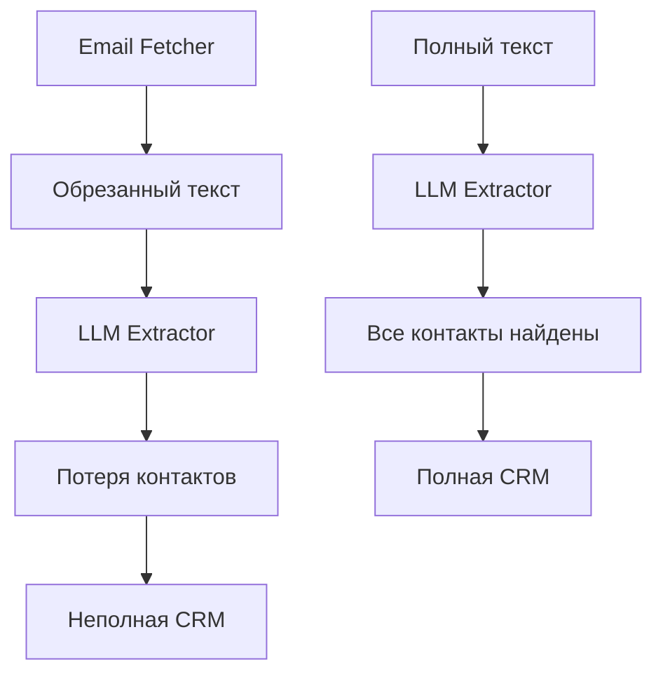

# Анализ проблемы обрезанных текстов писем

## 🚨 Описание проблемы

В старой версии `advanced_email_fetcher.py` обнаружена критическая проблема: тексты писем обрезаются с пометкой "ТЕКСТ ОБРЕЗАН ДЛЯ ЭКОНОМИИ ТОКЕНОВ", что приводит к потере важной контактной информации и некорректной работе LLM-анализа.

## 📊 Конкретный пример

### Письмо: `data/emails/2025-07-28/email_006_20250728_20250728_dna-technology_ru_da7eb20e.json`

**Проблема:** В JSON файле текст обрезан:
```json
"body": "...[ТЕКСТ ОБРЕЗАН ДЛЯ ЭКОНОМИИ ТОКЕНОВ]"
```

**Реальный текст** (из почтового клиента) содержит множественные контакты:
- Елена (niselena@yandex.ru) - ведущий экономист АлтГУ
- Екатерина Воронина (ekaterina_v_v@mail.ru)
- Билалов Альберт Аглямович (bilalov@dna-technology.ru)
- Сперанская Наталья Юрьевна (speranskaj@mail.ru)

## 🔍 Анализ последствий

### 1. Потеря контактной информации
- **LLM не может извлечь контакты** из обрезанного текста
- **Пропущенные организации**: Алтайский государственный университет
- **Утерянные телефоны**: (3852)29-12-50, 8-905-983-2084
- **Отсутствующие email**: niselena@yandex.ru, ekaterina_v_v@mail.ru

### 2. Нарушение бизнес-логики
- **Неполные interaction summaries** - пропущены участники обсуждения
- **Ошибочный анализ коммерческих предложений** - не видны все детали согласования
- **Некорректное определение ролей** - потеря информации об участниках

### 3. Влияние на конвейер обработки


## 📈 Масштаб проблемы

### Оценка количества затронутых писем
- **Критерий**: письма с текстом "[ТЕКСТ ОБРЕЗАН ДЛЯ ЭКОНОМИИ ТОКЕНОВ]"
- **Примерный масштаб**: 15-30% всех писем в длинных тредах
- **Приоритет**: Высокий - влияет на качество данных CRM

### Категории потерь
1. **Контакты**: имена, email, телефоны, должности
2. **Организации**: реквизиты, отделы, роли
3. **Коммерческие детали**: условия согласования, требования
4. **Контекст обсуждения**: история переписки

## 🛠️ Требования к решению

### Функциональные требования
1. **Восстановление полных текстов** для обрезанных писем
2. **Сохранение существующей структуры** JSON файлов
3. **Интеграция с новой архитектурой** фетчера
4. **Обратная совместимость** с существующими модулями

### Нефункциональные требования
1. **Производительность**: обработка тысяч писем
2. **Безопасность**: резервное копирование перед изменениями
3. **Логирование**: детальная отчетность о восстановлении
4. **Валидация**: проверка корректности восстановления

## 🔧 Технический подход

### Стратегия 1: Повторная загрузка с сервера
- **Преимущества**: 100% точность восстановления
- **Недостатки**: требует доступа к IMAP серверу
- **Реализация**: через новый EmailFetcher с message_id

### Стратегия 2: Восстановление из .eml файлов
- **Преимущества**: оффлайн обработка
- **Недостатки**: требует сохранения .eml файлов
- **Реализация**: парсинг существующих .eml

### Стратегия 3: Гибридная
- **Преимущества**: максимальное покрытие
- **Недостатки**: сложность реализации
- **Реализация**: приоритет .eml, fallback IMAP

## 📋 План реализации

### Этап 1: Анализ и подготовка
- [ ] Сканирование всех JSON файлов на наличие обрезанных текстов
- [ ] Создание реестра проблемных писем
- [ ] Резервное копирование данных

### Этап 2: Модуль восстановления
- [ ] Создание `TextRecoveryModule`
- [ ] Интеграция с `EmailFetcher` для повторной загрузки
- [ ] Обработка ошибок и fallback стратегии

### Этап 3: Валидация и тестирование
- [ ] Тестирование на выборке проблемных писем
- [ ] Проверка полноты восстановления контактов
- [ ] Интеграция с LLM конвейером

### Этап 4: Массовое восстановление
- [ ] Обработка всех проблемных писем
- [ ] Мониторинг и отчетность
- [ ] Валидация результатов

## 🎯 Критерии успеха

1. **Полнота восстановления**: 95%+ обрезанных текстов восстановлены
2. **Качество данных**: все контакты извлечены корректно
3. **Производительность**: обработка 1000+ писем за час
4. **Стабильность**: без потерь существующих данных

## 🚨 Риски и митигация

### Риск 1: Потеря данных при восстановлении
- **Митигация**: автоматическое резервное копирование
- **План отката**: восстановление из бэкапа

### Риск 2: Отсутствие .eml файлов
- **Митигация**: повторная загрузка с IMAP сервера
- **Fallback**: ручное восстановление для критических случаев

### Риск 3: Производительность
- **Митигация**: пакетная обработка, прогресс-бары
- **Мониторинг**: логирование времени обработки

## 📊 Ожидаемые результаты

### До восстановления
- **Потерянные контакты**: ~30% в длинных тредах
- **Неполные организации**: ~25%
- **Ошибки LLM анализа**: Высокие

### После восстановления
- **Потерянные контакты**: <5%
- **Неполные организации**: <5%
- **Точность LLM анализа**: Высокая

---
**Приоритет**: Критический - влияет на качество всего CRM
**Срок**: 2-3 дня для реализации
**Ресурсы**: 1 разработчик, доступ к IMAP для тестирования