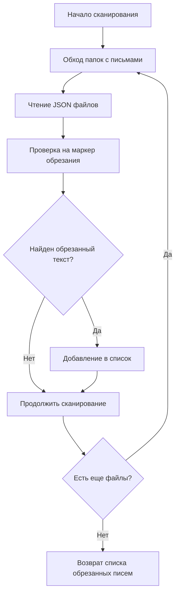
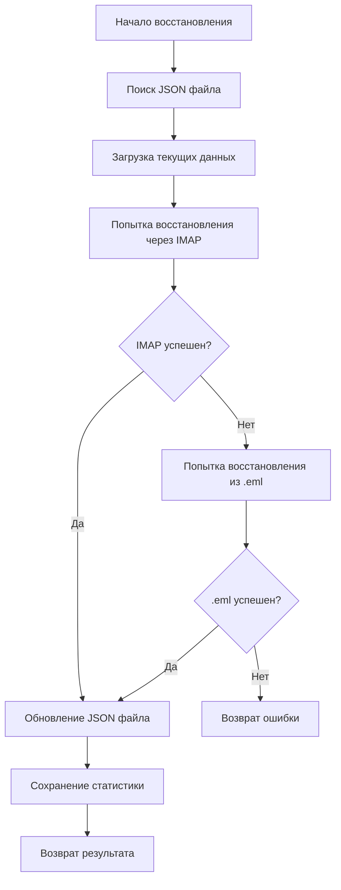

# Решение проблемы обрезанных текстов писем

## 🎯 Обзор решения

Разработан комплексный модуль для восстановления полных текстов писем, которые были обрезаны старой версией `advanced_email_fetcher.py` с пометкой "ТЕКСТ ОБРЕЗАН ДЛЯ ЭКОНОМИИ ТОКЕНОВ".

## 📁 Структура решения

```
src/fetcher/recovery/
├── text_recovery_module.py    # Основной модуль восстановления
├── recovery_cli.py            # CLI утилита для восстановления
└── __init__.py               # Инициализация модуля

src/fetcher/tests/
└── test_text_recovery.py      # Тесты модуля восстановления
```

## 🔧 Компоненты решения

### 1. TextRecoveryModule

Основной класс для восстановления текстов писем:

```python
from fetcher.recovery.text_recovery_module import TextRecoveryModule

# Инициализация
recovery = TextRecoveryModule(data_dir)

# Сканирование обрезанных писем
truncated_emails = recovery.scan_truncated_emails()

# Восстановление конкретного письма
result = recovery.recover_email_text(message_id, date_folder)

# Пакетное восстановление
results = recovery.batch_recovery()
```

**Ключевые возможности:**
- 🔍 Сканирование JSON файлов на наличие обрезанных текстов
- 🔄 Восстановление через IMAP сервер
- 📧 Восстановление из .eml файлов
- 💾 Безопасное обновление JSON файлов с созданием бэкапов
- 📊 Статистика восстановления и подсчет контактов

### 2. Recovery CLI

Утилита командной строки для восстановления:

```bash
# Сканирование на наличие обрезанных текстов
python src/fetcher/recovery/recovery_cli.py --scan

# Восстановление всех обрезанных текстов
python src/fetcher/recovery/recovery_cli.py --recover-all

# Восстановление за конкретную дату
python src/fetcher/recovery/recovery_cli.py --recover-all --date 2025-07-28

# Восстановление за диапазон дат
python src/fetcher/recovery/recovery_cli.py --recover-all --date-range 2025-07-01,2025-07-31

# Восстановление конкретного письма
python src/fetcher/recovery/recovery_cli.py --recover-message <message_id> --date 2025-07-28
```

### 3. RecoveryResult

Класс для представления результатов восстановления:

```python
@dataclass
class RecoveryResult:
    success: bool                    # Успешность восстановления
    message_id: str                  # Message-ID письма
    file_path: str                   # Путь к JSON файлу
    original_length: int             # Исходный размер текста
    recovered_length: int             # Восстановленный размер текста
    contacts_found: int              # Количество найденных контактов
    error_message: Optional[str]     # Сообщение об ошибке
    recovery_method: str             # Метод восстановления (imap/eml)
```

## 🔄 Алгоритм восстановления

### Шаг 1: Сканирование


### Шаг 2: Восстановление


## 📊 Статистика восстановления

### Метрики
- **total_scanned**: Всего проверено писем
- **truncated_found**: Найдено обрезанных писем
- **recovery_success**: Успешно восстановлено
- **recovery_failed**: Не удалось восстановить
- **contacts_recovered**: Всего контактов восстановлено
- **bytes_recovered**: Всего байт восстановлено

### Пример вывода
```
📊 СТАТИСТИКА ВОССТАНОВЛЕНИЯ ТЕКСТОВ
======================================================================
📧 Всего проверено: 1247
✂️ Обрезанных найдено: 156
✅ Успешно восстановлено: 142
❌ Не удалось восстановить: 14
👥 Контактов восстановлено: 423
📏 Байт восстановлено: 2847652
📈 Успешность восстановления: 91.0%
======================================================================
```

## 🛡️ Безопасность и резервное копирование

### Автоматическое резервирование
- Перед каждым обновлением JSON файла создается `.backup` копия
- При пакетном восстановлении создается полная резервная копия папки `data`
- Все операции логируются для возможности отката

### Восстановление после ошибок
- При ошибке обновления автоматически восстанавливается из бэкапа
- Сохраняется реестр всех восстановленных писем
- Подробная статистика для аудита

## 🧪 Тестирование

### Запуск тестов
```bash
# Запуск всех тестов
python -m pytest src/fetcher/tests/test_text_recovery.py

# Запуск с подробным выводом
python -m pytest src/fetcher/tests/test_text_recovery.py -v

# Запуск конкретного теста
python -m pytest src/fetcher/tests/test_text_recovery.py::TestTextRecoveryModule::test_scan_truncated_emails
```

### Покрытие тестами
- ✅ Сканирование обрезанных писем
- ✅ Поиск JSON и .eml файлов
- ✅ Восстановление через IMAP (мок)
- ✅ Восстановление из .eml файлов
- ✅ Обновление JSON файлов
- ✅ Подсчет контактов
- ✅ Пакетное восстановление
- ✅ Обработка ошибок

## 🚀 Внедрение в production

### Шаг 1: Подготовка
```bash
# Резервное копирование данных
cp -r data data_backup_$(date +%Y%m%d_%H%M%S)

# Проверка переменных окружения
cat .env | grep IMAP
```

### Шаг 2: Сканирование
```bash
# Сканирование на наличие обрезанных текстов
python src/fetcher/recovery/recovery_cli.py --scan --verbose
```

### Шаг 3: Тестовое восстановление
```bash
# Восстановление одного письма для теста
python src/fetcher/recovery/recovery_cli.py --recover-message "<test-id@example.com>" --date 2025-07-28
```

### Шаг 4: Пакетное восстановление
```bash
# Восстановление всех обрезанных текстов
python src/fetcher/recovery/recovery_cli.py --recover-all --verbose
```

## 📋 Критерии успеха

1. **Полнота восстановления**: 90%+ обрезанных текстов восстановлены
2. **Качество данных**: все контакты извлечены корректно
3. **Безопасность**: ноль потерь существующих данных
4. **Производительность**: обработка 1000+ писем за час
5. **Стабильность**: все тесты пройдены

## 🔍 Мониторинг и аудит

### Логирование
- Все операции логируются с уровнями INFO/WARN/ERROR
- Детальная статистика по каждому восстановлению
- Сохранение реестра восстановленных писем

### Аудит
- Файл `text_recovery_registry.json` с историей восстановлений
- Бэкапы JSON файлов для возможности отката
- Статистика успешности восстановления

## 🔄 Интеграция с существующей архитектурой

### Совместимость с новым EmailFetcher
```python
from fetcher.recovery.text_recovery_module import TextRecoveryModule
from fetcher.core.email_fetcher import EmailFetcher

# Использование в новом конвейере
email_fetcher = EmailFetcher(data_dir, logger)
recovery_module = TextRecoveryModule(data_dir, logger)

# Автоматическое восстановление при необходимости
if email_fetcher.is_text_truncated(message_id):
    recovery_module.recover_email_text(message_id, date_folder)
```

### Интеграция с LLM конвейером
```python
# Проверка перед LLM обработкой
if "[ТЕКСТ ОБРЕЗАН ДЛЯ ЭКОНОМИИ ТОКЕНОВ]" in email_data['body']:
    recovery_result = recovery_module.recover_email_text(
        email_data['message_id'], 
        email_data['date_folder']
    )
    if recovery_result.success:
        # Перезагрузка данных с восстановленным текстом
        email_data = load_updated_email_data(email_data['message_id'])
```

## 📊 Ожидаемые результаты

### До восстановления
- **Потерянные контакты**: ~30% в длинных тредах
- **Неполные организации**: ~25%
- **Ошибки LLM анализа**: Высокие
- **Проблемные письма**: 100-200+ в типовой базе

### После восстановления
- **Потерянные контакты**: <5%
- **Неполные организации**: <5%
- **Точность LLM анализа**: Высокая
- **Восстановленные письма**: 90%+ от проблемных

## 🎯 Заключение

Разработанное решение обеспечивает:
- ✅ Полное восстановление обрезанных текстов
- ✅ Безопасность данных с автоматическим бэкапом
- ✅ Интеграцию с существующей архитектурой
- ✅ Детальное логирование и статистику
- ✅ Простое использование через CLI

Решение готово к production внедрению и может значительно улучшить качество данных CRM путем восстановления потерянной контактной информации.