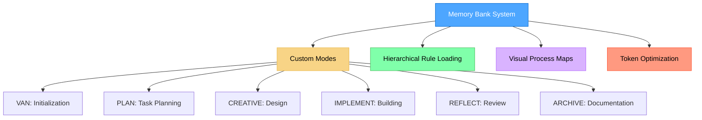
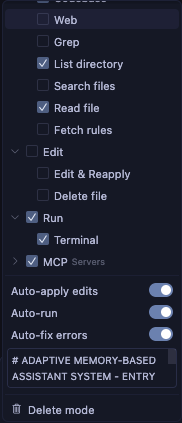
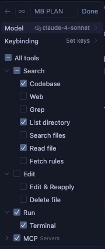
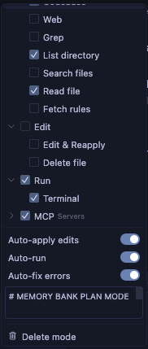
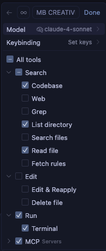
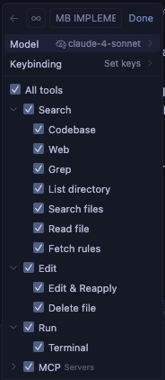
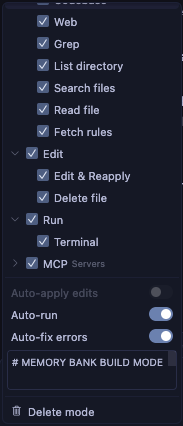
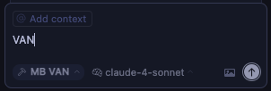
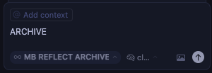
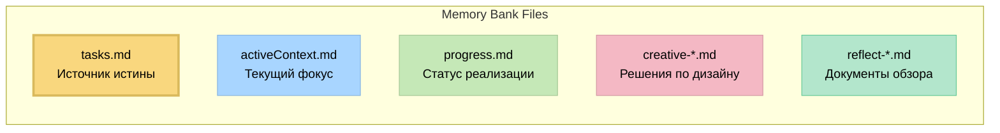

# Memory Bank System v0.7-beta

## Послание от создателя

Привет всем! 👋

Когда я создавал cursor-memory-bank, это был мой личный проект для решения проблемы, с которой я сталкивался ежедневно как инженер-программист. Имея большой опыт в этой области, я знал, что должен быть лучший способ использовать ИИ для реальной работы по разработке.

Ваши **2,400+ звезд** и невероятная обратная связь показали, что эта идея нашла отклик — но также показали мне, что я стремился не просто к инструментам настройки. **Я хотел рабочие прототипы.**

Поэтому я вернулся к своим корням инженера-программиста и создал нечто, выполняющее изначальное обещание: **Трехуровневая архитектура оркестрации**, которая использует продвинутое проектирование промптов и специализированных агентов для выполнения всей тяжелой работы — от запроса на естественном языке до протестированного в браузере приложения.

**То, что начиналось как мое личное решение в cursor-memory-bank, теперь завершено:**
- Скажите "реализуй этот PRD.md" → Получите полный разбор проекта с координацией TaskMaster
- Скажите "создай систему управления пользователями с RBAC" → Получите иерархию ролей из 5 уровней с 28 разрешениями
- Скажите "создай платформу электронной коммерции" → Получите каталог продуктов, корзину, оформление заказа и интеграцию платежей
- Скажите "добавь функции совместной работы в реальном времени" → Получите реализацию WebSocket с разрешением конфликтов

Опираясь на мой инженерный опыт, новая система устраняет основные ограничения, сохраняя изначальное видение: **ИИ, который действительно создает рабочее программное обеспечение.** По мере обнаружения новых вызовов мы добавляем специализированных агентов, чтобы система продолжала развиваться.

cursor-memory-bank останется здесь как основа, сделавшая это возможным. Но если вы хотите увидеть, куда ведет мое инженерное путешествие, ознакомьтесь с эволюцией:

**👉 [Claude Code Sub-Agent Collective](https://github.com/vanzan01/claude-code-sub-agent-collective)**

Спасибо за то, что сделали мой личный проект успешным. Будущее еще более захватывающее! 🚀

*- vanzan*

---

Модульная, управляемая документацией система управления задачами, оптимизированная по токенам, которая интегрируется с кастомными режимами Cursor для эффективных рабочих процессов разработки.



> **Личное примечание**: Memory Bank — это мой личный хобби-проект, который я разрабатываю для использования в своих кодинговых проектах. Поскольку это личный проект, я не веду трекер проблем и не собираю обратную связь активно. Однако, если вы используете эти правила и сталкиваетесь с проблемами, одним из преимуществ является то, что вы можете попросить Cursor AI напрямую изменить или обновить правила, чтобы они лучше соответствовали вашему рабочему процессу. Система спроектирована так, чтобы быть адаптируемой через ИИ, позволяя вам настраивать ее под свои нужды без необходимости внешней поддержки.

## О системе Memory Bank

Memory Bank — это личный проект, предоставляющий структурированный подход к разработке с использованием специализированных режимов для разных фаз процесса разработки. Система использует архитектуру иерархической загрузки правил, которая загружает только необходимые правила для каждой фазы, оптимизируя использование токенов и предоставляя целенаправленное руководство.

### Архитектура, оптимизированная по токенам

Версия 0.7-beta включает значительные улучшения в оптимизации токенов:

- **Иерархическая загрузка правил**: Загружает только необходимые правила с использованием специализированной ленивой загрузки
- **Прогрессивная документация**: Внедряет краткие шаблоны, которые масштабируются в зависимости от сложности задачи
- **Оптимизированные переходы между режимами**: Эффективно сохраняет критически важный контекст между режимами
- **Рабочие процессы по уровням**: Адаптирует требования к документации под сложность задачи

См. документ [Memory Bank Optimizations](MEMORY_BANK_OPTIMIZATIONS.md) для подробной информации обо всех подходах к оптимизации.

### Расширение возможностей кастомных режимов

В то время как документация Cursor описывает кастомные режимы как преимущественно автономные конфигурации с базовыми подсказками и выбором инструментов, Memory Bank значительно расширяет эту концепцию:

- **Интеграция режимов на основе графа**: Режимы представляют собой взаимосвязанные узлы в рабочем процессе разработки, а не изолированные инструменты
- **Прогрессия рабочего процесса**: Режимы спроектированы для логического перехода от одного к другому (VAN → PLAN → CREATIVE → IMPLEMENT → REFLECT → ARCHIVE)
- **Общая память**: Сохранение состояния между переходами режимов через файлы Memory Bank
- **Адаптивное поведение**: Каждый режим адаптирует свои рекомендации в зависимости от сложности проекта
- **Встроенные функции QA**: Возможности QA могут быть вызваны из любого режима для технической валидации

Этот подход превращает кастомные режимы из простых ИИ-персоналий в компоненты скоординированной системы разработки с специализированными фазами, работающими вместе.

### Режим CREATIVE и инструмент "Think" от Claude

Режим CREATIVE в Memory Bank концептуально основан на методологии инструмента "Think" от Anthropic’s Claude, описанной в их [инженерном блоге](https://www.anthropic.com/engineering/claude-think-tool). Версия v0.7-beta реализует оптимизированную версию с:

- Прогрессивной документацией с табличным сравнением вариантов
- Подходом "детали по запросу", сохраняющим эффективность токенов
- Структурированными шаблонами, масштабируемыми в зависимости от уровня сложности
- Эффективным сохранением контекста для фазы реализации

Для подробного объяснения, как Memory Bank реализует эти принципы, см. документ [CREATIVE Mode and Claude's "Think" Tool](creative_mode_think_tool.md).

## Основные возможности

- **Иерархическая загрузка правил**: Загрузка только необходимых правил с ленивой загрузкой
- **Прогрессивная документация**: Краткие шаблоны, масштабируемые в зависимости от сложности задачи
- **Единая передача контекста**: Эффективное сохранение контекста между режимами
- **Визуальные карты для каждого режима**: Четкие визуальные представления для каждой фазы разработки
- **Рабочие процессы по уровням**: Адаптированные процессы в зависимости от сложности (уровни 1-4)
- **Команды, учитывающие платформу**: Автоматическая адаптация команд под вашу операционную систему

## Инструкции по установке

### Предварительные требования

- **Cursor Editor**: Требуется версия 0.48 или выше.
- **Custom Modes**: Функция должна быть включена в Cursor (Настройки → Функции → Чат → Кастомные режимы).


- **AI-модель**: Рекомендуется Claude 4 Sonnet или Claude 4 Opus для наилучших результатов, особенно для методологии инструмента "Think" в режиме CREATIVE.

### Шаг 1: Получение файлов

Просто клонируйте репозиторий в директорию вашего проекта:

```
git clone https://github.com/vanzan01/cursor-memory-bank.git
```

#### Альтернатива (ручная)

После распаковки из ZIP-файла выполните следующие шаги.

- Скопируйте папки `.cursor` и `custom_modes` в директорию проекта

Примечание: другие документы не обязательны для работы Memory Bank, они являются пояснительными. Вы можете скопировать их в папку, например, `memory_bank_documents`.

### Шаг 2: Настройка кастомных режимов в Cursor

**Это наиболее важная и сложная часть настройки.** Вам нужно вручную создать шесть кастомных режимов в Cursor и скопировать содержимое инструкций из предоставленных файлов:

#### Как добавить кастомный режим в Cursor

1. Откройте Cursor и щелкните на селектор режимов в панели чата
2. Выберите "Add custom mode"


3. На экране конфигурации:
   - Введите имя режима (можно включить эмодзи, такие как 🔍, 📋, 🎨, ⚒️, скопировав их в начало имени)
   - Выберите иконку из ограниченного набора предопределенных вариантов Cursor
   - Добавьте ярлык (опционально)
   - Отметьте необходимые инструменты
   - Нажмите на **Advanced options**
   - В появившееся текстовое поле внизу вставьте содержимое инструкций из соответствующего файла

#### Конфигурация режимов

Для каждого режима настройте следующим образом (если MCPs отображаются, их можно оставить включенными, они, вероятно, не будут работать):

1. **VAN MODE** (Инициализация)
   - **Name**: 🔍 VAN
   - **Tools**: Включите "Codebase Search", "Read File", "Terminal", "List Directory", "Fetch Rules"
   - **Advanced options**: Вставьте из `custom_modes/van_instructions.md`


 

2. **PLAN MODE** (Планирование задач)
   - **Name**: 📋 PLAN
   - **Tools**: Включите "Codebase Search", "Read File", "Terminal", "List Directory"
   - **Advanced options**: Вставьте из `custom_modes/plan_instructions.md`

 

3. **CREATIVE MODE** (Проектирование)
   - **Name**: 🎨 CREATIVE
   - **Tools**: Включите "Codebase Search", "Read File", "Terminal", "List Directory", "Edit File", "Fetch Rules"
   - **Advanced options**: Вставьте из `custom_modes/creative_instructions.md`

 

4. **IMPLEMENT MODE** (Реализация кода)
   - **Name**: ⚒️ IMPLEMENT
   - **Tools**: Включите все инструменты
   - **Advanced options**: Вставьте из `custom_modes/implement_instructions.md`

 

5. **REFLECT & ARCHIVE MODE** (Обзор и архивирование)
   - **Name**: 🔍 REFLECT or ARCHIVE
   - **Tools**: Включите "Codebase Search", "Read File", "Terminal", "List Directory"
   - **Advanced options**: Вставьте из `custom_modes/reflect_archive_instructions.md`

 


> **Примечание**: Инструкции REFLECT и ARCHIVE объединены в один файл и режим для оптимизации ограничений Cursor по количеству символов и режимов, сохраняя функциональность. Благодарность пользователю GitHub @joshmac007 за эту оптимизацию.

Для дополнительной помощи по настройке кастомных режимов обратитесь к [официальной документации Cursor по кастомным режимам](https://docs.cursor.com/chat/custom-modes).

### Функциональность QA

QA не является отдельным кастомным режимом, а представляет собой набор функций валидации, которые можно вызвать из любого режима. Вы можете использовать возможности QA, введя "QA" в любом режиме, когда требуется техническая валидация. Этот подход обеспечивает гибкость для проведения проверки на любом этапе процесса разработки.

## Базовое использование

1. **Начните с режима VAN**:
   - Переключитесь на режим VAN в Cursor
   - Введите "VAN" для запуска процесса инициализации
   - VAN проанализирует структуру вашего проекта и определит уровень сложности

2. **Следуйте рабочему процессу в зависимости от сложности**:
   - **Задачи уровня 1**: Могут переходить сразу к IMPLEMENT после VAN
   - **Задачи уровня 2**: Упрощенный процесс (VAN → PLAN → IMPLEMENT → REFLECT)
   - **Задачи уровней 3-4**: Полный процесс (VAN → PLAN → CREATIVE → IMPLEMENT → REFLECT → ARCHIVE)
   - **В любой момент**: Введите "QA" для выполнения технической валидации


      

3. **Команды, специфичные для режимов**:
   ```
   VAN - Инициализация проекта и определение сложности
   PLAN - Создание детального плана реализации
   CREATIVE - Исследование вариантов дизайна для сложных компонентов
   IMPLEMENT - Систематическая разработка запланированных компонентов
   REFLECT - Обзор и документирование полученных уроков
   ARCHIVE - Создание полной документации
   QA - Валидация технической реализации (может быть вызвано из любого режима)
   ```

4. **Начало работы с вашим проектом**:

После успешной установки Memory Bank...

## Основные файлы и их назначение



- **tasks.md**: Центральный источник истины для отслеживания задач
- **activeContext.md**: Поддерживает фокус текущей фазы разработки
- **progress.md**: Отслеживает статус реализации
- **creative-*.md**: Документы решений по дизайну, созданные в режиме CREATIVE
- **reflect-*.md**: Документы обзора, созданные в режиме REFLECT

## Устранение неполадок

### Распространенные проблемы

1. **Режим не отвечает корректно**:
   - Убедитесь, что инструкции скопированы полностью (это наиболее частая проблема)
   - Проверьте, включены ли правильные инструменты для каждого режима
   - Убедитесь, что вы переключились на правильный режим перед вводом команд
   - Проверьте, что инструкции вставлены в текстовое поле "Advanced options"

2. **Правила не загружаются**:
   - Убедитесь, что директория `.cursor/rules/isolation_rules/` находится в правильном месте
   - Проверьте, что права доступа позволяют читать файлы правил

3. **Проблемы с выполнением команд**:
   - Убедитесь, что вы выполняете команды из правильной директории
   - Проверьте, что используются правильные команды для вашей платформы

## Информация о версии

Это версия v0.7-beta системы Memory Bank. Она включает значительные улучшения в оптимизации токенов по сравнению с v0.6-beta, сохраняя всю функциональность. См. [Release Notes](RELEASE_NOTES.md) для подробной информации об изменениях.

### Текущая разработка

Система Memory Bank активно развивается и улучшается. Основные моменты:

- **Работа в процессе**: Это бета-версия с продолжающейся разработкой. Ожидайте регулярные обновления, оптимизации и новые функции.
- **Оптимизация функций**: Модульная архитектура позволяет проводить непрерывное улучшение без нарушения существующей функциональности.
- **Доступна предыдущая версия**: Если вы предпочитаете стабильность предыдущей версии (v0.1-legacy), вы можете продолжать ее использовать, пока эта версия не станет стабильной.
- **Преимущества архитектуры**: Перед выбором версии ознакомьтесь с [Memory Bank Upgrade Guide](memory_bank_upgrade_guide.md) для понимания значительных преимуществ новой архитектуры.

## Ресурсы

- [Memory Bank Optimizations](MEMORY_BANK_OPTIMIZATIONS.md) — Подробный обзор улучшений эффективности токенов
- [Release Notes](RELEASE_NOTES.md) — Информация о последних изменениях
- [Cursor Custom Modes Documentation](https://docs.cursor.com/chat/custom-modes)
- [Memory Bank Upgrade Guide](memory_bank_upgrade_guide.md)
- [CREATIVE Mode and Claude's "Think" Tool](creative_mode_think_tool.md)
- Файлы инструкций для конкретных режимов в директории `custom_modes/`

---

*Примечание: Этот README относится к версии v0.7-beta и может измениться по мере развития системы.*