# Режим CREATIVE и инструмент "Think" от Claude

Этот документ объясняет, как режим CREATIVE в Memory Bank реализует концепции, схожие с методологией инструмента "Think" от Claude компании Anthropic, описанной в их [инженерном блоге](https://www.anthropic.com/engineering/claude-think-tool).

## Концептуальные параллели

Следующая диаграмма иллюстрирует концептуальные сходства между методологией инструмента "Think" от Claude и режимом CREATIVE в Memory Bank:

```mermaid
graph TD
    subgraph "Подход инструмента Think от Claude"
        CT1["1: Разложение проблемы"] --> CT2["2: Исследование пространства решений"]
        CT2 --> CT3["3: Анализ компромиссов"]
        CT3 --> CT4["4: Выбор и документирование решения"]
        CT4 --> CT5["5: Проверка решения"]
    end
    
    subgraph "Режим CREATIVE в Memory Bank"
        CM1["1: Разбиение на компоненты"] --> CM2["2: Исследование вариантов"]
        CM2 --> CM3["3: Анализ компромиссов"]
        CM3 --> CM4["4: Документирование решения"]
        CM4 --> CM5["5: Проверка решения"]
    end
    
    style CT1 fill:#f9d77e,stroke:#d9b95c,color:black
    style CT2 fill:#f9d77e,stroke:#d9b95c,color:black
    style CT3 fill:#f9d77e,stroke:#d9b95c,color:black
    style CT4 fill:#f9d77e,stroke:#d9b95c,color:black
    style CT5 fill:#f9d77e,stroke:#d9b95c,color:black

    style CM1 fill:#a8d5ff,stroke:#88b5e0,color:black
    style CM2 fill:#a8d5ff,stroke:#88b5e0,color:black
    style CM3 fill:#a8d5ff,stroke:#88b5e0,color:black
    style CM4 fill:#a8d5ff,stroke:#88b5e0,color:black
    style CM5 fill:#a8d5ff,stroke:#88b5e0,color:black
```



## Основные принципы инструмента "Think" от Claude

Методология инструмента "Think" от Claude основывается на:

1. **Структурированный процесс мышления**: Разбиение сложных проблем на управляемые компоненты.
2. **Явное обоснование**: Четкое документирование процесса рассуждений.
3. **Исследование вариантов**: Систематическое изучение нескольких подходов к решению.
4. **Анализ компромиссов**: Оценка плюсов и минусов различных вариантов.
5. **Документирование решений**: Создание записей о решениях и их обоснованиях.

## Как режим CREATIVE реализует эти принципы

Режим CREATIVE в Memory Bank воплощает схожие концепции через:

### 1. Структурированные фазы

Режим CREATIVE обеспечивает структурированный подход к принятию проектных решений через явные фазы:

```
Фаза 1: Разбиение на компоненты
Фаза 2: Исследование вариантов
Фаза 3: Анализ компромиссов
Фаза 4: Документирование решения
Фаза 5: Проверка решения
```

Каждая фаза имеет конкретные выходные данные и критерии приемки, которые должны быть выполнены перед переходом к следующей.

### 2. Шаблоны разбиения компонентов

Режим CREATIVE предоставляет шаблоны для разбиения сложных компонентов:

```markdown
# Компонент: [Название компонента]

## Функциональные требования
- [Требование 1]
- [Требование 2]

## Технические ограничения
- [Ограничение 1]
- [Ограничение 2]

## Точки интеграции
- [Точка интеграции 1]
- [Точка интеграции 2]
```

### 3. Шаблоны исследования вариантов

Для изучения альтернативных дизайнов:

```markdown
# Вариант дизайна: [Название варианта]

## Основной подход
[Краткое описание подхода]

## Детали реализации
[Ключевые аспекты реализации]

## Предварительная оценка
- **Сильные стороны**: [Список сильных сторон]
- **Слабые стороны**: [Список слабых сторон]
- **Неизвестные**: [Список неизвестных]
```

### 4. Матрица анализа компромиссов

Для систематического сравнения вариантов:

```markdown
# Анализ компромиссов

| Критерий | Вариант A | Вариант B | Вариант C |
|----------|-----------|-----------|-----------|
| Производительность | Оценка | Оценка | Оценка |
| Поддерживаемость | Оценка | Оценка | Оценка |
| Масштабируемость | Оценка | Оценка | Оценка |
| Сложность | Оценка | Оценка | Оценка |
| Риск | Оценка | Оценка | Оценка |

## Детальный анализ
[Подробное обсуждение компромиссов]
```

### 5. Документирование решений

Для фиксации окончательных решений с обоснованиями:

```markdown
# Решение по дизайну: [Название решения]

## Выбранный подход
[Описание выбранного подхода]

## Обоснование
[Объяснение, почему выбран этот подход]

## Отвергнутые альтернативы
[Краткое описание рассмотренных, но не выбранных альтернатив]

## Руководство по реализации
[Заметки для руководства реализацией]
```

## Практический пример

Вот упрощенный пример того, как может выглядеть сессия в режиме CREATIVE при проектировании системы кэширования данных:

### Шаг 1: Разбиение проблемы

```
CREATIVE: Давайте спроектируем систему кэширования для нашего приложения. Сначала разберем компоненты и требования.

Компонент: Система кэширования данных

Функциональные требования:
- Хранение часто запрашиваемых данных для снижения нагрузки на базу данных
- Обеспечение настраиваемых политик истечения срока действия
- Обработка инвалидации кэша
- Поддержка распределенного кэширования между экземплярами приложения

Технические ограничения:
- Должна работать с существующей инфраструктурой Redis
- Использование памяти не должно превышать 2 ГБ
- Операции кэширования должны завершаться в течение 10 мс
```

### Шаг 2: Исследование вариантов

```
Рассмотрим три варианта дизайна:

Вариант A: Простая реализация ключ-значение в Redis
- Прямое использование хранилища ключ-значение Redis с сериализацией строк
- Простое истечение срока действия на основе TTL
- Ручная инвалидация через удаление ключей

Вариант B: Иерархический кэш на основе Redis Hash
- Организация данных в Redis Hashes по типу сущности
- Использование Redis pub/sub для уведомлений об инвалидации
- Реализация иерархических политик истечения срока действия

Вариант C: Гибридный локально-распределенный кэш Redis
- Локальный кэш LRU в памяти как первый уровень
- Redis как распределенный кэш второго уровня
- Фоновая синхронизация между уровнями
```

### Шаг 3: Анализ компромиссов

```
Анализ компромиссов:

| Критерий | Вариант A | Вариант B | Вариант C |
|----------|-----------|-----------|-----------|
| Сложность реализации | Низкая | Средняя | Высокая |
| Производительность | Средняя | Средняя | Высокая |
| Эффективность памяти | Средняя | Высокая | Средняя |
| Масштабируемость | Средняя | Высокая | Высокая |
| Поддержка | Низкая | Средняя | Высокая |

Детальный анализ:
- Вариант A самый простой, но предоставляет ограниченные функции
- Вариант B предлагает хороший баланс производительности и функций
- Вариант C обеспечивает лучшую производительность, но за счет сложности
```

### Шаг 4: Документирование решения

```
Решение по дизайну: Иерархический кэш на основе Redis Hash (Вариант B)

Обоснование:
- Обеспечивает хороший баланс между производительностью и поддерживаемостью
- Лучшая эффективность памяти по сравнению с Вариантом A благодаря структуре Redis Hash
- Меньшая сложность, чем у Варианта C, при выполнении требований по производительности
- Лучше поддерживает нашу распределенную архитектуру

Руководство по реализации:
- Создать класс CacheManager с API, специфичными для сущностей
- Реализовать слушатели Redis pub/sub для событий инвалидации
- Добавить мониторинг частоты попаданий/промахов кэша
```

## Соответствие основной методологии

Структурированный подход в приведенном выше примере отражает методологию инструмента "Think" от Claude за счет:

1. **Разбиения** проблемы кэширования на конкретные требования и ограничения
2. **Исследования** нескольких вариантов дизайна систематически
3. **Анализа компромиссов** с использованием явных критериев
4. **Документирования решений** с четкими обоснованиями
5. **Предоставления руководства по реализации** на основе решения

## Влияние на процесс разработки

Реализация методологий, вдохновленных Claude, в режиме CREATIVE приносит несколько преимуществ:

1. **Улучшение качества решений**: Более систематическое исследование вариантов
2. **Лучшее документирование решений**: Явная фиксация обоснований дизайна
3. **Сохранение знаний**: Решения по дизайну сохраняются для дальнейшего использования
4. **Снижение предвзятости в дизайне**: Структурированный подход уменьшает когнитивные искажения
5. **Более четкое руководство по реализации**: Фаза реализации получает более ясное направление

## Постоянное совершенствование

По мере развития возможностей Claude реализация этих методологий в режиме CREATIVE будет совершенствоваться для:

- Включения достижений в подходах к структурированному мышлению
- Улучшения шаблонов и фреймворков для принятия проектных решений
- Углубления интеграции с другими режимами Memory Bank
- Оптимизации баланса между структурой и гибкостью

Цель — сохранить основную методологию, постоянно улучшая ее практическую реализацию в экосистеме Memory Bank.

---

*Примечание: Этот документ описывает, как Memory Bank версии 0.6-beta реализует концепции, схожие с методологией инструмента "Think" от Claude. Реализация будет продолжать развиваться по мере совершенствования обеих систем.*