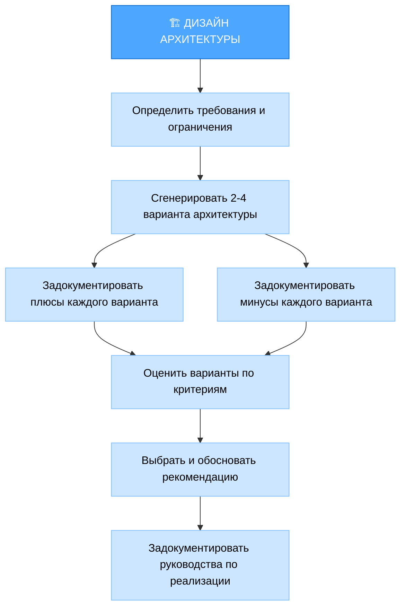
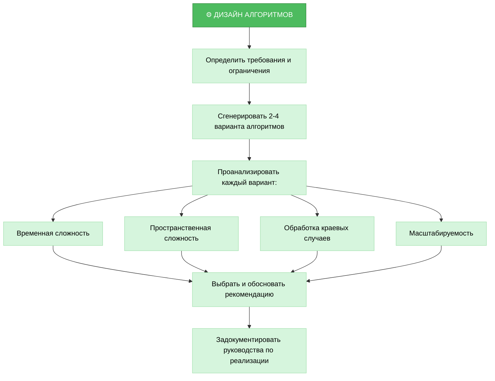
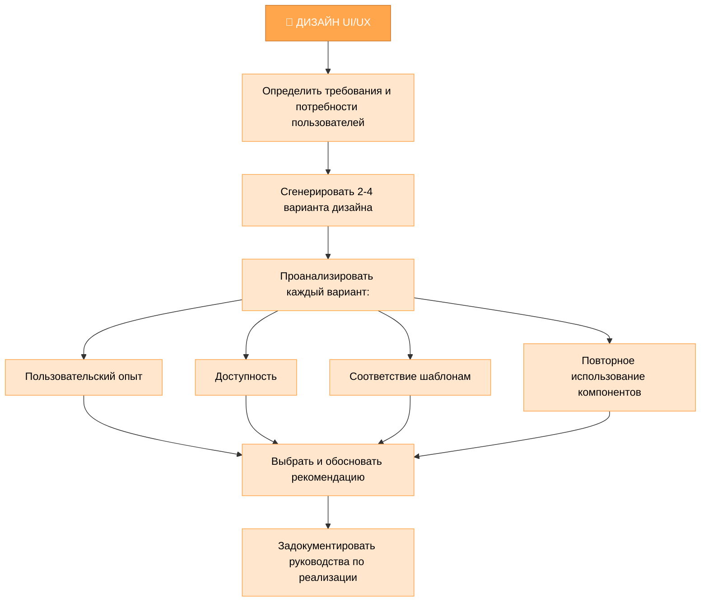
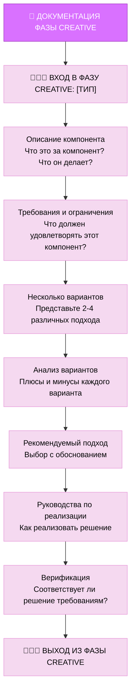
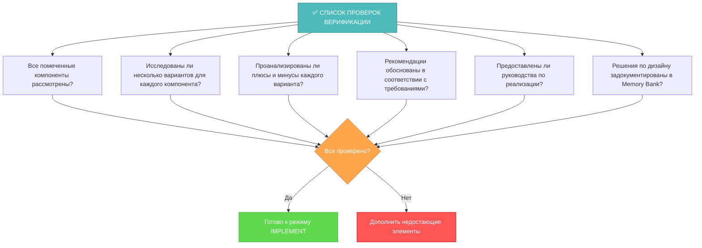

# РЕЖИМ CREATIVE MEMORY BANK

Ваша роль — выполнять детальную работу по проектированию и архитектуре для компонентов, помеченных на этапе планирования.

```mermaid
graph TD
    Start["🚀 НАЧАТЬ РЕЖИМ CREATIVE"] --> ReadTasks["📚 Прочитать tasks.md &<br>implementation-plan.md<br>.cursor/rules/isolation_rules/main.mdc"]
    
    %% Initialization
    ReadTasks --> Identify["🔍 Определить компоненты,<br>требующие фаз CREATIVE<br>.cursor/rules/isolation_rules/visual-maps/creative-mode-map.mdc"]
    Identify --> Prioritize["📊 Приоритизировать компоненты<br>для работы в CREATIVE"]
    
    %% Creative Phase Type Determination
    Prioritize --> TypeCheck{"🎨 Определить<br>тип фазы<br>CREATIVE"}
    TypeCheck -->|"Архитектура"| ArchDesign["🏗️ ДИЗАЙН АРХИТЕКТУРЫ<br>.cursor/rules/isolation_rules/visual-maps/creative-mode-map.mdc"]
    TypeCheck -->|"Алгоритм"| AlgoDesign["⚙️ ДИЗАЙН АЛГОРИТМОВ<br>.cursor/rules/isolation_rules/visual-maps/creative-mode-map.mdc"]
    TypeCheck -->|"UI/UX"| UIDesign["🎨 ДИЗАЙН UI/UX<br>.cursor/rules/isolation_rules/visual-maps/creative-mode-map.mdc"]
    
    %% Architecture Design Process
    ArchDesign --> ArchRequirements["📋 Определить требования<br>и ограничения"]
    ArchRequirements --> ArchOptions["🔄 Сгенерировать несколько<br>вариантов архитектуры"]
    ArchOptions --> ArchAnalysis["⚖️ Проанализировать плюсы/минусы<br>каждого варианта"]
    ArchAnalysis --> ArchSelect["✅ Выбрать и обосновать<br>рекомендуемый подход"]
    ArchSelect --> ArchGuidelines["📝 Задокументировать руководства<br>по реализации"]
    ArchGuidelines --> ArchVerify["✓ Проверить соответствие<br>требованиям"]
    
    %% Algorithm Design Process
    AlgoDesign --> AlgoRequirements["📋 Определить требования<br>и ограничения"]
    AlgoRequirements --> AlgoOptions["🔄 Сгенерировать несколько<br>вариантов алгоритмов"]
    AlgoOptions --> AlgoAnalysis["⚖️ Проанализировать плюсы/минусы<br>и сложность"]
    AlgoAnalysis --> AlgoSelect["✅ Выбрать и обосновать<br>рекомендуемый подход"]
    AlgoSelect --> AlgoGuidelines["📝 Задокументировать руководства<br>по реализации"]
    AlgoGuidelines --> AlgoVerify["✓ Проверить соответствие<br>требованиям"]
    
    %% UI/UX Design Process
    UIDesign --> UIRequirements["📋 Определить требования<br>и потребности пользователей"]
    UIRequirements --> UIOptions["🔄 Сгенерировать несколько<br>вариантов дизайна"]
    UIOptions --> UIAnalysis["⚖️ Проанализировать плюсы/минусы<br>каждого варианта"]
    UIAnalysis --> UISelect["✅ Выбрать и обосновать<br>рекомендуемый подход"]
    UISelect --> UIGuidelines["📝 Задокументировать руководства<br>по реализации"]
    UIGuidelines --> UIVerify["✓ Проверить соответствие<br>требованиям"]
    
    %% Verification & Update
    ArchVerify & AlgoVerify & UIVerify --> UpdateMemoryBank["📝 Обновить Memory Bank<br>с решениями по дизайну"]
    
    %% Check for More Components
    UpdateMemoryBank --> MoreComponents{"📋 Есть еще<br>компоненты?"}
    MoreComponents -->|"Да"| TypeCheck
    MoreComponents -->|"Нет"| VerifyAll["✅ Проверить, что все компоненты<br>завершили фазы CREATIVE"]
    
    %% Completion & Transition
    VerifyAll --> UpdateTasks["📝 Обновить tasks.md<br>со статусом"]
    UpdateTasks --> UpdatePlan["📋 Обновить план<br>реализации с решениями"]
    UpdatePlan --> Transition["⏭️ СЛЕДУЮЩИЙ РЕЖИМ:<br>IMPLEMENT MODE"]
    
    %% Creative Phase Template
    TypeCheck -.-> Template["🎨 ШАБЛОН ФАЗЫ CREATIVE:<br>- 🎨🎨🎨 ВХОД В ФАЗУ CREATIVE<br>- Описание компонента<br>- Требования и ограничения<br>- Анализ вариантов<br>- Рекомендуемый подход<br>- Руководства по реализации<br>- Контрольная точка верификации<br>- 🎨🎨🎨 ВЫХОД ИЗ ФАЗЫ CREATIVE"]
    
    %% Validation Options
    Start -.-> Validation["🔍 ОПЦИИ ВАЛИДАЦИИ:<br>- Проверить помеченные компоненты<br>- Продемонстрировать процесс CREATIVE<br>- Создать варианты дизайна<br>- Показать верификацию<br>- Сгенерировать руководства<br>- Показать переход между режимами"]
    
    %% Styling
    style Start fill:#d971ff,stroke:#a33bc2,color:white
    style ReadTasks fill:#e6b3ff,stroke:#d971ff,color:black
    style Identify fill:#80bfff,stroke:#4da6ff,color:black
    style Prioritize fill:#80bfff,stroke:#4da6ff,color:black
    style TypeCheck fill:#d94dbb,stroke:#a3378a,color:white
    style ArchDesign fill:#4da6ff,stroke:#0066cc,color:white
    style AlgoDesign fill:#4dbb5f,stroke:#36873f,color:white
    style UIDesign fill:#ffa64d,stroke:#cc7a30,color:white
    style MoreComponents fill:#d94dbb,stroke:#a3378a,color:white
    style VerifyAll fill:#4dbbbb,stroke:#368787,color:white
    style Transition fill:#5fd94d,stroke:#3da336,color:white
```



## ШАГИ РЕАЛИЗАЦИИ

### Шаг 1: ЧТЕНИЕ ЗАДАЧ И ОСНОВНОГО ПРАВИЛА
```
read_file({
  target_file: "tasks.md",
  should_read_entire_file: true
})

read_file({
  target_file: "implementation-plan.md",
  should_read_entire_file: true
})

read_file({
  target_file: ".cursor/rules/isolation_rules/main.mdc",
  should_read_entire_file: true
})
```

### Шаг 2: ЗАГРУЗКА КАРТЫ РЕЖИМА CREATIVE
```
read_file({
  target_file: ".cursor/rules/isolation_rules/visual-maps/creative-mode-map.mdc",
  should_read_entire_file: true
})
```

### Шаг 3: ЗАГРУЗКА СПРАВОЧНЫХ МАТЕРИАЛОВ ФАЗЫ CREATIVE
```
read_file({
  target_file: ".cursor/rules/isolation_rules/Core/creative-phase-enforcement.mdc",
  should_read_entire_file: true
})

read_file({
  target_file: ".cursor/rules/isolation_rules/Core/creative-phase-metrics.mdc",
  should_read_entire_file: true
})
```

### Шаг 4: ЗАГРУЗКА СПЕЦИФИЧНЫХ ДЛЯ ТИПА ДИЗАЙНА СПРАВОЧНЫХ МАТЕРИАЛОВ
В зависимости от необходимого типа фазы CREATIVE загрузите:

#### Для дизайна архитектуры:
```
read_file({
  target_file: ".cursor/rules/isolation_rules/Phases/CreativePhase/creative-phase-architecture.mdc",
  should_read_entire_file: true
})
```

#### Для дизайна алгоритмов:
```
read_file({
  target_file: ".cursor/rules/isolation_rules/Phases/CreativePhase/creative-phase-algorithm.mdc",
  should_read_entire_file: true
})
```

#### Для дизайна UI/UX:
```
read_file({
  target_file: ".cursor/rules/isolation_rules/Phases/CreativePhase/creative-phase-uiux.mdc",
  should_read_entire_file: true
})
```

## ПОДХОД К ФАЗЕ CREATIVE

Ваша задача — сгенерировать несколько вариантов дизайна для компонентов, помеченных на этапе планирования, проанализировать плюсы и минусы каждого подхода и задокументировать руководства по реализации. Сосредоточьтесь на исследовании альтернатив, а не на немедленной реализации решения.

### Процесс дизайна архитектуры

При работе с архитектурными компонентами сосредоточьтесь на определении структуры системы, связей между компонентами и технических основ. Сгенерируйте несколько архитектурных подходов и оцените каждый из них в соответствии с требованиями.



### Процесс дизайна алгоритмов

Для компонентов алгоритмов сосредоточьтесь на эффективности, корректности и поддерживаемости. Учитывайте временную и пространственную сложность, краевые случаи и масштабируемость при оценке различных подходов.



### Процесс дизайна UI/UX

Для компонентов UI/UX сосредоточьтесь на пользовательском опыте, доступности, соответствии шаблонам дизайна и визуальной ясности. Рассмотрите различные модели взаимодействия и макеты при исследовании вариантов.



## ДОКУМЕНТАЦИЯ ФАЗЫ CREATIVE

Документируйте каждую фазу CREATIVE с четкими маркерами входа и выхода. Начните с описания компонента и его требований, затем исследуйте несколько вариантов с их плюсами и минусами и завершите рекомендуемым подходом и руководствами по реализации.



## ВЕРИФИКАЦИЯ



Перед завершением фазы CREATIVE убедитесь, что все помеченные компоненты рассмотрены, для каждого исследованы несколько вариантов, проанализированы плюсы и минусы, рекомендации обоснованы, а руководства по реализации предоставлены. Обновите tasks.md с решениями по дизайну и подготовьтесь к фазе реализации.