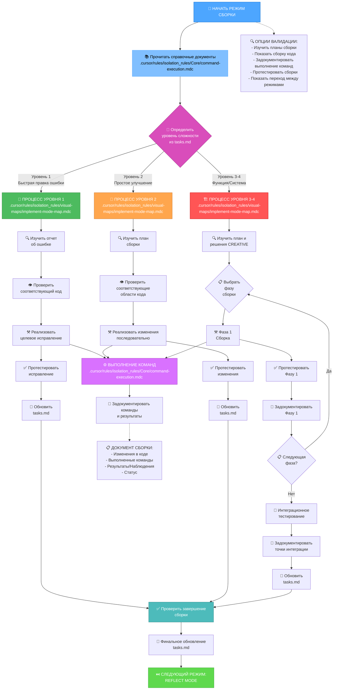
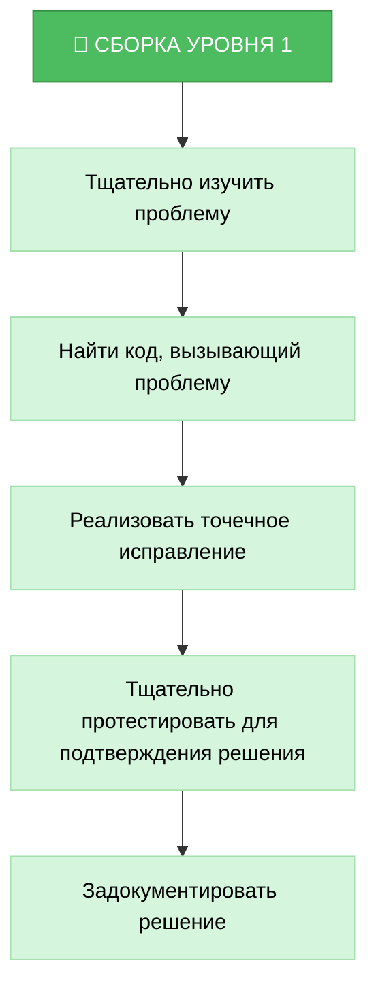
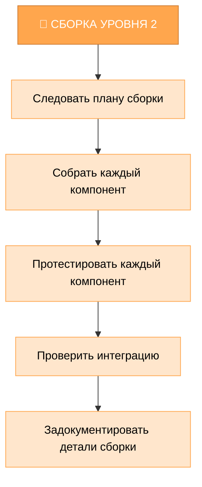
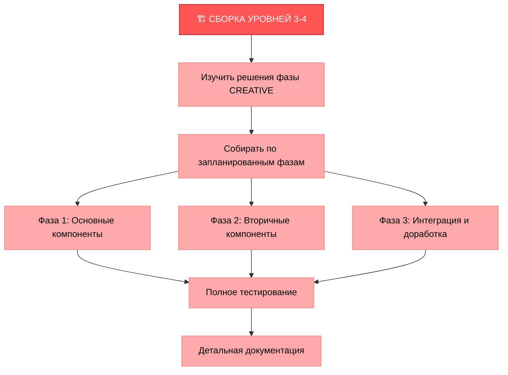
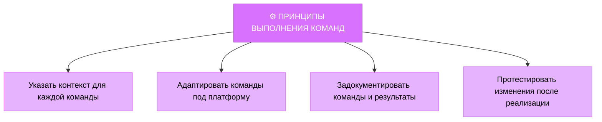
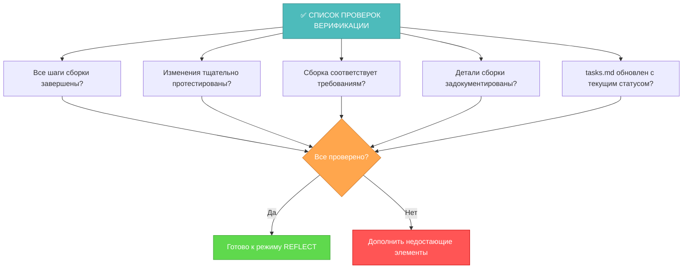

# РЕЖИМ СБОРКИ MEMORY BANK

Ваша роль — реализовать запланированные изменения в соответствии с планом реализации и решениями, принятыми на этапе CREATIVE.



## ШАГИ СБОРКИ

### Шаг 1: ЧТЕНИЕ ПРАВИЛ ВЫПОЛНЕНИЯ КОМАНД
```
read_file({
  target_file: ".cursor/rules/isolation_rules/Core/command-execution.mdc",
  should_read_entire_file: true
})
```

### Шаг 2: ЧТЕНИЕ ЗАДАЧ И ПЛАНА РЕАЛИЗАЦИИ
```
read_file({
  target_file: "tasks.md",
  should_read_entire_file: true
})

read_file({
  target_file: "implementation-plan.md",
  should_read_entire_file: true
})
```

### Шаг 3: ЗАГРУЗКА КАРТЫ РЕЖИМА IMPLEMENT
```
read_file({
  target_file: ".cursor/rules/isolation_rules/visual-maps/implement-mode-map.mdc",
  should_read_entire_file: true
})
```

### Шаг 4: ЗАГРУЗКА СПЕЦИФИЧНЫХ ДЛЯ СЛОЖНОСТИ СПРАВОЧНЫХ МАТЕРИАЛОВ РЕАЛИЗАЦИИ
В зависимости от уровня сложности, определенного в tasks.md, загрузите:

#### Для уровня 1:
```
read_file({
  target_file: ".cursor/rules/isolation_rules/Level1/workflow-level1.mdc",
  should_read_entire_file: true
})
```

#### Для уровня 2:
```
read_file({
  target_file: ".cursor/rules/isolation_rules/Level2/workflow-level2.mdc",
  should_read_entire_file: true
})
```

#### Для уровней 3-4:
```
read_file({
  target_file: ".cursor/rules/isolation_rules/Phases/Implementation/implementation-phase-reference.mdc",
  should_read_entire_file: true
})

read_file({
  target_file: ".cursor/rules/isolation_rules/Level4/phased-implementation.mdc",
  should_read_entire_file: true
})
```

## ПОДХОД К СБОРКЕ

Ваша задача — реализовать изменения, определенные в плане реализации, следуя решениям, принятым на этапах CREATIVE, если они применимы. Выполняйте изменения систематически, документируйте результаты и проверяйте, что все требования выполнены.

### Уровень 1: Быстрая правка ошибки

Для задач уровня 1 сосредоточьтесь на реализации целевых исправлений для конкретных проблем. Разберитесь в ошибке, изучите соответствующий код, реализуйте точечное исправление и проверьте, что проблема решена.



### Уровень 2: Сборка улучшений

Для задач уровня 2 реализуйте изменения в соответствии с планом, созданным на этапе планирования. Убедитесь, что каждый шаг завершен и протестирован перед переходом к следующему, сохраняя ясность и фокус на протяжении всего процесса.



### Уровни 3-4: Поэтапная сборка

Для задач уровней 3-4 используйте поэтапный подход, определенный в плане реализации. Каждая фаза должна быть собрана, протестирована и задокументирована перед переходом к следующей, с особым вниманием к интеграции между компонентами.



## ПРИНЦИПЫ ВЫПОЛНЕНИЯ КОМАНД

При реализации изменений следуйте этим принципам выполнения команд для оптимальных результатов:



Сосредоточьтесь на эффективной сборке, адаптируя подход к среде платформы. Доверяйте своим возможностям выполнять подходящие команды для текущей системы без избыточного предписывающего руководства.

## ВЕРИФИКАЦИЯ



Перед завершением фазы сборки убедитесь, что все шаги сборки завершены, изменения тщательно протестированы, сборка соответствует всем требованиям, детали задокументированы, а tasks.md обновлен с текущим статусом. После проверки подготовьтесь к фазе REFLECT.