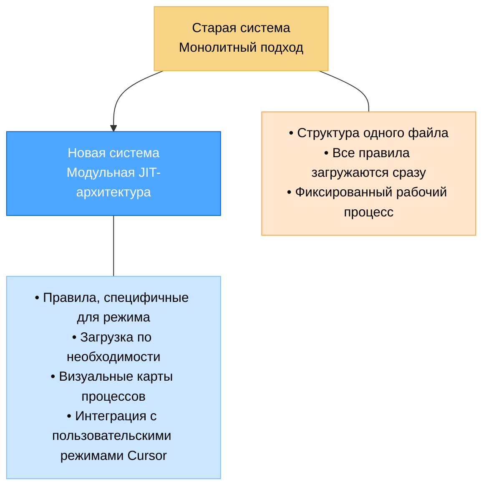
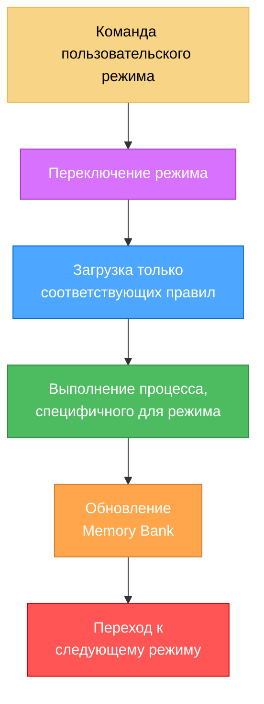
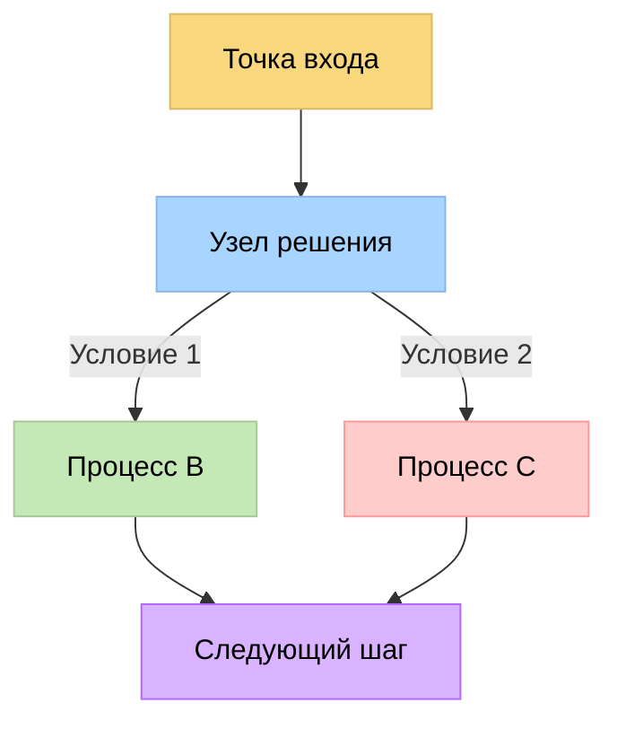
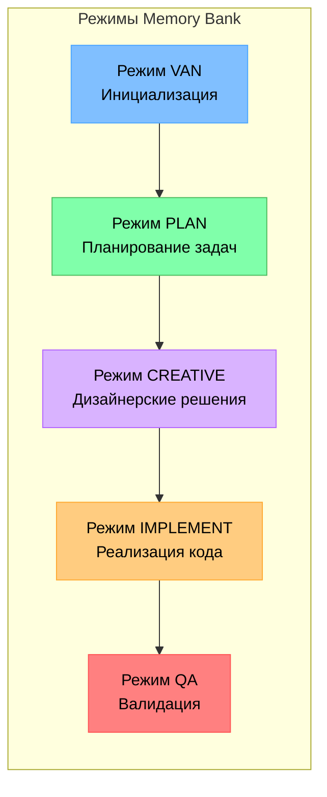
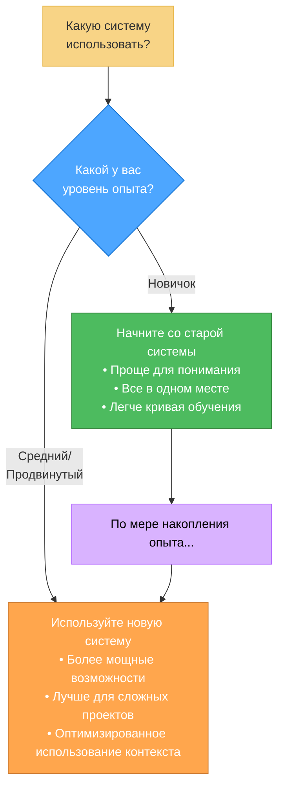
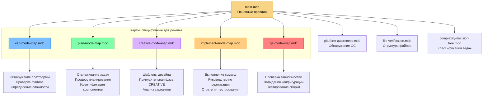
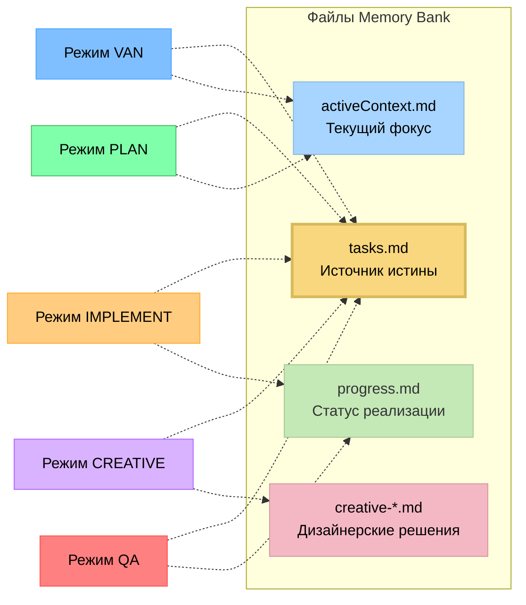
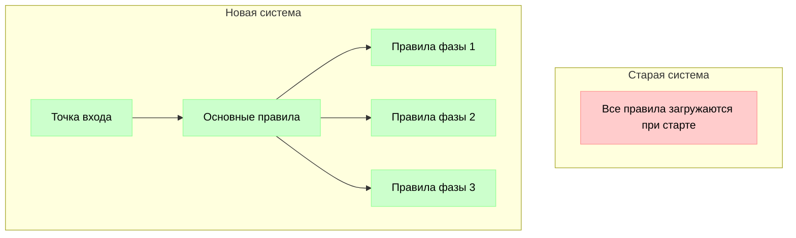
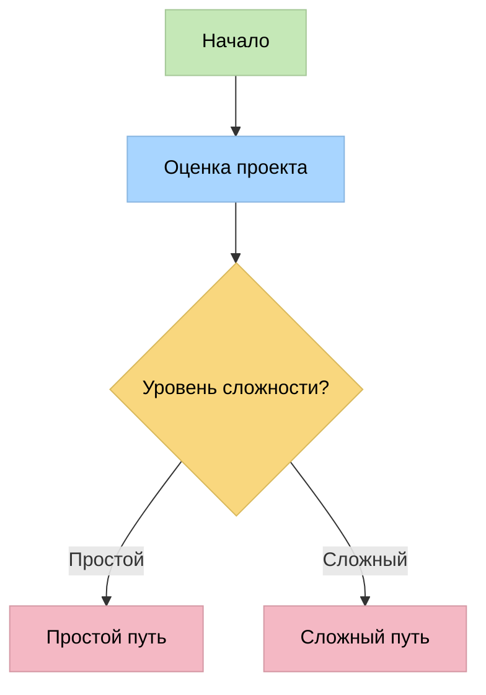

# Руководство по обновлению системы Memory Bank: от монолитной к модульной

## Введение

Я рад представить значительное обновление системы Memory Bank – переход от монолитного подхода "всё в одном" к модульной, графо-ориентированной системе, интегрированной с пользовательскими режимами Cursor. Этот документ объясняет причины перехода, его преимущества и как максимально эффективно использовать новую систему.



## Почему я обновляю систему

Старая система Memory Bank хорошо справлялась, обеспечивая структурированный подход к управлению задачами с адаптивными уровнями сложности и подробной документацией. Однако по мере роста сложности проектов я выявил несколько ограничений:

1. **Неэффективность контекста**: Загрузка всех правил сразу, независимо от их актуальности
2. **Ограниченное визуальное руководство**: Текстовые инструкции без визуальных карт процессов
3. **Потеря токенов**: Занятие контекстного окна ненужными правилами
4. **Универсальный подход**: Меньшая адаптация к конкретным фазам разработки
5. **Проблемы масштабируемости**: Сложности в поддержке растущей системы одного файла

Хотя новая система предлагает значительные преимущества в эффективности и масштабируемости, я признаю, что она вводит более крутую кривую обучения. Этот компромисс намеренный – повышенная начальная сложность обеспечивает более мощные возможности, лучшую организацию и улучшенные долгосрочные результаты разработки для сложных проектов.

## Новая архитектура, ориентированная на изоляцию

Новая система устраняет эти ограничения благодаря модульной архитектуре с загрузкой по необходимости (Just-In-Time, JIT), которая загружает только те правила, которые вам нужны в данный момент.



Важно, что новая система сохраняет базовую шкалу сложности из 4 уровней от оригинальной системы. Эта шкала (Уровень 1: Быстрое исправление ошибок, Уровень 2: Простое улучшение, Уровень 3: Средняя функциональность, Уровень 4: Сложная система) остается центральной для определения путей рабочего процесса и требований к документации, обеспечивая преемственность для пользователей, знакомых с оригинальным подходом.

### Ключевые особенности новой системы

1. **Визуальные карты, специфичные для режима**: Четкие визуальные представления для каждой фазы разработки
2. **Загрузка правил по необходимости**: Загрузка только тех правил, которые нужны для текущей задачи
3. **Визуальные деревья решений**: Направляемые рабочие процессы с четкими контрольными точками
4. **Техническая валидация**: Специализированные процессы QA для проверки готовности к реализации
5. **Команды, учитывающие платформу**: Автоматическая адаптация команд к вашей операционной системе

### Эффективность на основе графа

Фундаментальным фактором возможностей новой системы является ее графо-ориентированная архитектура:

- **Оптимизированная навигация по путям**: Система использует направленные графы для навигации по сложным деревьям решений с минимальными накладными расходами
- **Контекстные связи**: Структуры графа явно моделируют связи между фазами разработки и компонентами, обеспечивая более умные переходы
- **Оптимизация ресурсов**: Каждый узел графа загружает только те ресурсы, которые нужны для конкретного шага
- **Потенциал параллельной обработки**: Структура графа упрощает определение компонентов, которые могут быть обработаны параллельно



**До**: Линейные пути выполнения с избыточной оценкой правил.

**После**: Оптимизированное прохождение через точки решений с четкими условиями и точками слияния.

Этот графо-ориентированный подход особенно эффективен при работе с крупными, сложными проектами, где различные компоненты имеют разные требования и зависимости. Система может эффективно справляться с этими сложностями, не перегружая контекстное окно.

### Режим CREATIVE и инструмент "Think" от Claude

Одним из заметных аспектов новой системы является то, что режим CREATIVE концептуально основан на методологии инструмента "Think" от Claude компании Anthropic, описанной в их [engineering blog](https://www.anthropic.com/engineering/claude-think-tool). Этот подход был усовершенствован и интегрирован в рабочий процесс Memory Bank:

- **Структурированное исследование**: Режим CREATIVE направляет пользователей через систематическое изучение вариантов дизайна
- **Явное обоснование**: Требует документирования плюсов и минусов различных подходов
- **Разбиение компонентов**: Помогает разбивать сложные проблемы на управляемые части
- **Документирование решений**: Создает формальные записи решений по дизайну с четкими обоснованиями
- **Непрерывное совершенствование**: Реализация будет продолжать развиваться по мере улучшения возможностей Claude

Эта методология оказалась особенно эффективной для сложных дизайнерских решений, гарантируя, что все варианты тщательно рассматриваются перед началом реализации.

## Интеграция с пользовательскими режимами Cursor

Новая система полностью использует функцию пользовательских режимов Cursor, которая позволяет задавать специализированные поведения ИИ для различных задач.

### Что такое пользовательские режимы Cursor?

Пользовательские режимы Cursor позволяют настраивать различные поведения ИИ с определенными инструментами и пользовательскими инструкциями. Новая система Memory Bank создает специализированные режимы для каждой фазы разработки:



Каждый режим загружает только необходимый набор правил, оптимизируя использование контекста и предоставляя специализированное руководство:

| Режим | Назначение | Ключевые особенности |
|-------|------------|--------------------|
| VAN | Инициализация | Обнаружение платформы, проверка файлов, определение сложности |
| PLAN | Планирование задач | Анализ требований, идентификация компонентов, стратегия реализации |
| CREATIVE | Дизайнерские решения | Исследование множества вариантов, анализ плюсов и минусов, рекомендации по дизайну |
| IMPLEMENT | Реализация кода | Систематическое создание, выполнение команд, тестирование |
| QA | Техническая валидация | Проверка зависимостей, валидация конфигурации, тестирование сборки |

### Помимо стандартной реализации пользовательских режимов Cursor

В то время как [документация Cursor по пользовательским режимам](https://docs.cursor.com/chat/custom-modes) описывает их в основном как отдельные конфигурации с настроенными подсказками и выбором инструментов, Memory Bank значительно расширяет эту концепцию:

#### Стандартный подход пользовательских режимов Cursor

Согласно документации Cursor, пользовательские режимы обычно состоят из:
- Установки имени, иконки и ярлыка
- Включения или отключения определенных инструментов
- Добавления пользовательских инструкций (подсказок)

Примерные режимы (Teach, Refactor, Plan и т.д.) функционируют как изолированные конфигурации без встроенных связей между ними. Каждый режим по сути является отдельной личностью ИИ с конкретными инструкциями.

#### Улучшенный подход пользовательских режимов Memory Bank

```mermaid
graph TD
    subgraph "Стандартный подход Cursor"
        M1["Режим 1<br>Статические инструкции"]
        M2["Режим 2<br>Статические инструкции"]
        M3["Режим 3<br>Статические инструкции"]
    end
    
    subgraph "Подход Memory Bank"
        MB1["Режим VAN<br>Динамические правила"]
        MB2["Режим PLAN<br>Динамические правила"]
        MB3["Режим CREATIVE<br>Динамические правила"]
        MB4["Режим IMPLEMENT<br>Динамические правила"]
        MB5["Режим QA<br>Динамические правила"]
        
        MB1 -->|"Передача контекста"| MB2
        MB2 -->|"Передача контекста"| MB3
        MB3 -->|"Передача контекста"| MB4
        MB4 -->|"Передача контекста"| MB5
        
        MemBank["Файлы Memory Bank<br>(Общее состояние)"]
        MB1 <-->|"Чтение/Запись"| MemBank
        MB2 <-->|"Чтение/Запись"| MemBank
        MB3 <-->|"Чтение/Запись"| MemBank
        MB4 <-->|"Чтение/Запись"| MemBank
        MB5 <-->|"Чтение/Запись"| MemBank
    end
    
    style M1 fill:#f8d486,stroke:#e8b84d,color:black
    style M2 fill:#f8d486,stroke:#e8b84d,color:black
    style M3 fill:#f8d486,stroke:#e8b84d,color:black
    
    style MB1 fill:#80bfff,stroke:#4da6ff,color:black
    style MB2 fill:#80ffaa,stroke:#4dbb5f,color:black
    style MB3 fill:#d9b3ff,stroke:#b366ff,color:black
    style MB4 fill:#ffcc80,stroke:#ffaa33,color:black
    style MB5 fill:#ff8080,stroke:#ff5555,color:black
    style MemBank fill:#f9d77e,stroke:#d9b95c,stroke-width:3px,color:black
```



Memory Bank преобразует пользовательские режимы в комплексную, взаимосвязанную систему:

1. **Графо-ориентированная архитектура**: 
   - Режимы представляют узлы в рабочем процессе разработки с явными переходами
   - Каждый режим понимает свое место в общем процессе разработки
   - Визуальные карты процессов направляют пользователей через правильную последовательность

2. **Интеграция рабочего процесса**: 
   - Режимы формируют единый процесс разработки (VAN → PLAN → CREATIVE → IMPLEMENT → QA)
   - Каждый режим знает о предыдущих и последующих режимах
   - Переходы между режимами формализованы с конкретными критериями входа/выхода

3. **Общая память**: 
   - Постоянное состояние сохраняется через переходы между режимами через файлы Memory Bank
   - tasks.md служит центральным источником истины для всех режимов
   - Каждый режим вносит определенные типы информации в общую базу знаний

4. **Загрузка правил по необходимости**: 
   - Каждый режим динамически загружает только свой специфический набор правил
   - Правила специализированы для текущей фазы разработки
   - Контекстное окно сохраняется для продуктивной работы
   - Правила могут адаптироваться в зависимости от уровня сложности проекта

5. **Визуальные карты процессов**: 
   - Каждый режим содержит встроенные диаграммы Mermaid
   - Визуальное руководство для точек принятия решений и вариантов рабочего процесса
   - Четкие контрольные точки для отслеживания прогресса в каждой фазе

6. **Поведение, адаптированное к сложности**: 
   - Режимы корректируют свое поведение в зависимости от уровня сложности, определенного на этапе инициализации
   - Более простые проекты следуют упрощенным процессам
   - Сложные проекты получают более полное руководство

### Преимущества этого подхода

Этот улучшенный подход к пользовательским режимам предлагает несколько преимуществ:

1. **Улучшенное использование контекста**: Загрузка только соответствующих правил освобождает больше контекста для реальной работы по разработке
2. **Последовательный процесс разработки**: Режимы работают вместе как единая система, а не как разрозненные инструменты
3. **Руководство, соответствующее фазе**: Каждая фаза разработки получает специализированное руководство, оптимизированное для ее нужд
4. **Сохранение знаний**: Важная информация сохраняется при переходах между режимами
5. **Снижение когнитивной нагрузки**: Разработчики могут сосредоточиться на текущей фазе, не отвлекаясь на неуместное руководство

### Возможные будущие улучшения

Если этот подход окажется успешным в ходе тестирования, он может вдохновить на несколько улучшений в использовании пользовательских режимов:

1. **Формализованные переходы между режимами**: Более явные передачи между фазами разработки
2. **Улучшенное визуальное руководство**: Более сложные карты процессов и деревья решений
3. **Глубокая интеграция с Memory Bank**: Более специализированные типы документов для различных фаз разработки
4. **Шаблоны пользовательских режимов**: Предварительно настроенные последовательности режимов для разных типов проектов
5. **Командное сотрудничество**: Координированное использование режимов несколькими членами команды

Хотя эта реализация вводит больше сложности в настройку по сравнению со стандартными пользовательскими режимами, она предлагает значительно более мощные возможности для структурированных процессов разработки. Система преобразует пользовательские режимы из изолированных поведений ИИ в компоненты комплексной методологии разработки.

## Реальные преимущества: данные из проектов

Мое тестирование на реальных проектах (включая сложное приложение Todo) продемонстрировало значительные преимущества новой системы:

1. **Принудительная дисциплина разработки**: Переключение режимов создавало естественные разделения фаз, снижая склонность сразу переходить к реализации
2. **Комплексная документация**: Каждый режим создавал специализированную документацию с явными дизайнерскими решениями
3. **Систематическая разработка**: Компоненты создавались в соответствии с планом в логическом порядке зависимостей
4. **Гибкость при необходимости**: Гибридные подходы (например, QA в IMPLEMENT) работали эффективно без потери структуры

Из документа анализа:

> "Я заметил ощутимые различия в подходе к разработке между режимами. Каждый режим успешно оптимизировал свою конкретную фазу разработки. Качество финального приложения выиграло от этого структурированного подхода."

## Сравнение: старая и новая системы

| Аспект | Старая система | Новая система |
|--------|----------------|---------------|
| **Структура** | Один файл | Несколько специализированных файлов |
| **Использование контекста** | Загружает все сразу | Загрузка по необходимости |
| **Руководство** | Текстовые инструкции | Визуальные карты процессов + текст |
| **Принятие решений** | Базовые точки решений | Комплексные деревья решений |
| **Техническая валидация** | Базовая проверка | Специализированные процессы QA |
| **Учет платформы** | Ограниченный | Комплексная адаптация |
| **Memory Bank** | Те же основные файлы | Те же основные файлы с улучшенной организацией |
| **Документация** | Стандартизированные форматы | Специализированные форматы для каждого режима |
| **Уровни сложности** | Шкала из 4 уровней | Та же шкала из 4 уровней с улучшенными процессами |

## Когда использовать каждую систему



### Рекомендации по использованию новой системы

- **Новые проекты**: Новая система лучше всего работает при запуске новых проектов, а не при преобразовании существующих
- **Тестовый подход**: Если вы хотите попробовать новую систему с существующим проектом, сначала сделайте резервную копию и экспериментируйте в безопасной среде
- **Отсутствие формального пути миграции**: Я не разработал формальный путь миграции от старой системы к новой – она предназначена для новых реализаций
- **Обучающие проекты**: Используйте старую систему для более простых проектов, если вы только осваиваете концепцию Memory Bank
- **Сложные проекты**: Новая система проявляет себя лучше всего в многокомпонентных проектах, требующих тщательного планирования

## Начало работы с новой системой

### Основные команды

Для активации различных режимов в новой системе:

```
VAN - Инициализация проекта и определение сложности
PLAN - Создание подробного плана реализации
CREATIVE - Исследование дизайнерских вариантов для сложных компонентов
IMPLEMENT - Систематическое создание запланированных компонентов
QA - Валидация технической реализации
```

### Пример рабочего процесса

1. Начните с `VAN` для инициализации проекта и определения сложности
2. Для задач уровней 2-4 перейдите в `PLAN` для создания комплексного плана реализации
3. Для компонентов, требующих дизайнерских решений, используйте `CREATIVE` для исследования вариантов
4. Реализуйте запланированные изменения с помощью `IMPLEMENT`
5. Проверяйте реализацию с помощью `QA` перед завершением

Уровень сложности (1-4), определенный в режиме VAN, значительно повлияет на ваш путь через рабочий процесс:
- **Задачи уровня 1** могут сразу перейти к IMPLEMENT после VAN
- **Задачи уровней 2-4** следуют полному рабочему процессу с возрастающей полнотой планирования и документации

## Глубокое погружение: Техническая архитектура

Для тех, кто интересуется техническими деталями, новая система использует графо-ориентированный подход с изолированными файлами правил, загружаемых по необходимости:



### Преемственность Memory Bank

Хотя правила модуляризированы, файлы Memory Bank обеспечивают преемственность между режимами:



## Практический пример: Разработка приложения Todo

Вот как я использовал новую систему для разработки сложного приложения Todo:

1. **Режим VAN**: Анализ требований, настройка структуры проекта, определение сложности уровня 3
2. **Режим PLAN**: Создание комплексной иерархии компонентов, определение зависимостей, обозначение компонентов для творческого исследования
3. **Режим CREATIVE**: Исследование множества вариантов управления состоянием и реализации фильтрации, документирование плюсов и минусов
4. **Режим IMPLEMENT**: Создание компонентов в логической последовательности в соответствии с планом, с интегрированной валидацией QA
5. **Результаты**: Более дисциплинированный процесс разработки, лучшая документация и более качественный конечный продукт

## Планы на будущее и дорожная карта разработки

Система Memory Bank – это мой личный хобби-проект, который приносит мне радость от создания и разработки. Я планирую продолжать его развивать на основе потребностей пользователей и моих собственных экспериментов. Вот некоторые направления, которые я исследую для дальнейшего развития:

### Краткосрочные улучшения

1. **Дальнейшая оптимизация правил JIT**: Усовершенствование системы загрузки правил для еще более эффективного использования контекста и ускорения времени ответа
2. **Интеграция обратной связи пользователей**: Создание структурированного цикла обратной связи для сбора данных от ранних пользователей и улучшения системы на основе реальных сценариев использования
3. **Разработка режима PRD**: Создание специального режима для документов с требованиями к продукту, использующего передовые модели ИИ Cursor для помощи пользователям в создании комплексных спецификаций продукта в той же среде, что и их разработка

### Дополнительные возможности под рассмотрением

4. **Функции командного сотрудничества**: Улучшение Memory Bank для поддержки одновременной работы нескольких пользователей с общим контекстом и скоординированными переходами между режимами
5. **Настраиваемые режимы**: Предоставление инструментов для создания пользователями собственных специализированных режимов с пользовательскими конфигурациями правил и картами процессов
6. **Межпроектная память**: Включение системы Memory Bank для сохранения релевантного контекста между различными проектами, улучшая передачу знаний и согласованность
7. **Панель аналитики**: Разработка инструментов для анализа шаблонов разработки, использования режимов и прогресса проектов для предоставления инсайтов и предложений по улучшению процессов
8. **Интеграция с системами контроля версий**: Создание более глубоких связей между документацией Memory Bank и историей версий кода для лучшей отслеживаемости

### Философия разработки

В процессе разработки этих новых функций я остаюсь верен следующим основным принципам:
- Создание приятных и мощных инструментов для структурированной разработки
- Фокус на новых реализациях, а не на путях миграции
- Баланс между мощностью и сложностью с соответствующими обучающими ресурсами
- Сохранение проверенной шкалы сложности из 4 уровней

Я приветствую мнение сообщества о том, какие из этих потенциальных направлений будут наиболее ценными для приоритизации в дорожной карте разработки.

## Заключение: Путь вперед

Новая система Memory Bank, ориентированная на изоляцию, представляет собой значительную эволюцию моего подхода к структурированной разработке. Хотя она вводит более крутую кривую обучения, преимущества в плане эффективности, руководства и масштабируемости делают ее стоящей для сложных проектов.

Мои рекомендации:
- **Новичкам**: Начните со старой системы, пока не освоите основные концепции
- **Новые проекты**: Используйте новую систему в первую очередь для новых проектов, а не для миграции существующих
- **Тестирование**: Если вы хотите попробовать новую систему с существующим проектом, сначала сделайте резервную копию и экспериментируйте в безопасной среде
- **Продвинутым пользователям**: Рассмотрите новую систему для значительных работ по разработке сложных проектов

Это экспериментальная система, созданная мной как личный хобби-проект. Я призываю вас попробовать ее, предоставить обратную связь и адаптировать под свои рабочие процессы. Используя пользовательские режимы Cursor и визуальные карты процессов, новая система Memory Bank предоставляет мощную основу для дисциплинированной, систематической разработки, которая масштабируется с увеличением сложности проекта.

---

## Ресурсы

- [Cursor Custom Modes Documentation](https://docs.cursor.com/chat/custom-modes)
- Memory Bank Reference Files (in .cursor/rules/isolation_rules/)
- Mode-specific instruction files (van_instructions.md, plan_instructions.md, etc.)
- [CREATIVE Mode and Claude's "Think" Tool](creative_mode_think_tool.md)

## Необходимость изменений

Предыдущая реализация Memory Bank имела несколько ограничений:

- **Ограниченная емкость контекста**: Все правила и команды загружались в единый контекст, уменьшая доступные токены для продуктивной работы
- **Фиксированный рабочий процесс**: Малая гибкость для адаптации к различным уровням сложности проектов
- **Избыточная загрузка правил**: Даже простые задачи загружали полный набор правил, что было неэффективным использованием контекста
- **Отсутствие визуального руководства**: Сложно понять процесс принятия решений системой
- **Ограниченный учет платформы**: Команды, специфичные для платформы, требовали ручной адаптации

## Ключевые архитектурные улучшения

Новая система Memory Bank устраняет эти ограничения через:


### 1. Загрузка правил по необходимости (JIT)

Вместо загрузки всех правил заранее система теперь:

- Загружает только правила, относящиеся к текущей фазе разработки
- Использует визуальные карты для определения, какие правила загружать и когда
- Динамически регулирует сложность правил в зависимости от требований задачи
- Сохраняет ценное пространство контекста для продуктивной работы



**До**: Все 25+ правил загружались при инициализации, потребляя около 70% доступного контекста.

**После**: В любой момент времени загружаются только 3-7 правил, что сокращает использование контекста до примерно 15-20%.

### 2. Эффективность на основе графа

Графо-ориентированная структура является основным фактором эффективности в новой системе:

- **Оптимизированная навигация по путям**: Система использует направленные графы для навигации по сложным деревьям решений с минимальными накладными расходами
- **Контекстные связи**: Структуры графа явно моделируют связи между фазами разработки и компонентами, обеспечивая более умные переходы
- **Оптимизация ресурсов**: Каждый узел в графе загружает только те ресурсы, которые нужны для конкретного шага
- **Потенциал параллельной обработки**: Структура графа упрощает определение компонентов, которые могут быть обработаны параллельно


**До**: Линейные пути выполнения с избыточной оценкой правил.

**После**: Оптимизированное прохождение через точки решений с четкими условиями и точками слияния.

### 3. Визуальные карты процессов, специфичные для режима

Теперь каждый режим имеет собственную визуальную карту процессов, которая:

- Четко иллюстрирует рабочий процесс для конкретной фазы разработки
- Предоставляет явные точки принятия решений и условные ветви
- Адаптируется к уровням сложности проекта
- Предлагает визуальные контрольные точки для отслеживания прогресса



### 4. Техническая валидация и учет платформы

Система теперь включает:

- **Автоматическое обнаружение платформы**: Автоматически адаптирует команды для Windows, MacOS или Linux
- **Проверка структуры файлов**: Проверяет структуру проекта перед продолжением
- **Контрольные точки QA**: Специализированная фаза технической валидации с конкретными критериями валидации
- **Более точное создание команд**: Команды, специфичные для платформы, с более высоким уровнем успеха