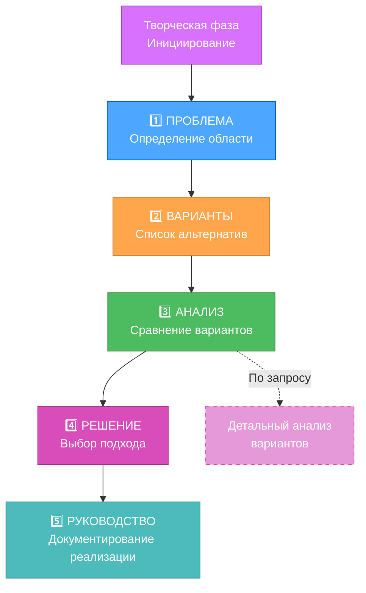
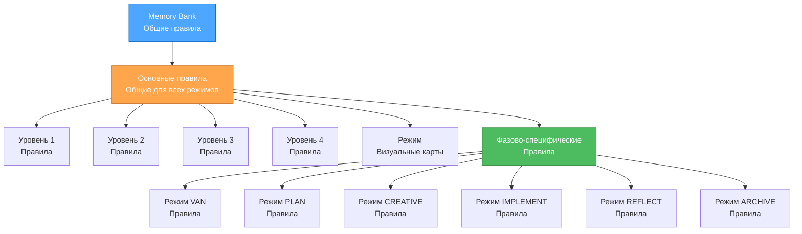

# ТЕКУЩЕЕ СОСТОЯНИЕ СИСТЕМЫ

> **Краткое содержание:** Система Memory Bank эволюционировала в токен-оптимизированную, иерархическую структуру с загрузкой правил по мере необходимости, прогрессивной документацией и эффективным сохранением контекста при переходе между режимами.

## 🎯 ОСНОВНЫЕ ОПТИМИЗАЦИИ СИСТЕМЫ

### 1. Иерархическая загрузка правил
- Загрузка специализированных правил по мере необходимости (JIT)
- Кэширование основных правил при переходе между режимами
- Выбор правил на основе сложности
- Значительное снижение использования токенов

### 2. Прогрессивная документация

### 3. Оптимизированные переходы между режимами
- Унифицированный протокол передачи контекста
- Стандартизированные документы для переходов
- Выборочное сохранение контекста
- Улучшенное сохранение контекста между режимами

### 4. Улучшенные рабочие процессы уровней
- Уровень 1: Ультракомпактные шаблоны для быстрых исправлений
- Уровень 2: Сбалансированный 4-фазный рабочий процесс с упрощёнными шаблонами
- Уровень 3: Оптимизированное исследование творческой фазы
- Уровень 4: Многоуровневые шаблоны документации для корпоративных проектов

### 5. Токен-оптимизированная архитектура

## 🔄 ЭФФЕКТИВНОСТЬ ОПТИМИЗАЦИИ

### Оптимизации для конкретных режимов
1. **Режим VAN**
   - Эффективное определение сложности с минимальными затратами
   - Команды, учитывающие платформу, с уменьшенным использованием токенов
   - Упрощённые процессы проверки файлов

2. **Режим PLAN**
   - Шаблоны планирования, соответствующие уровню сложности
   - Прогрессивное раскрытие деталей планирования
   - Табличный формат для организации задач

3. **Режим CREATIVE**
   - Прогрессивная документация с табличными сравнениями
   - Подход "детали по запросу" для творческого исследования
   - Эффективные шаблоны анализа вариантов

4. **Режим IMPLEMENT**
   - Упрощённое руководство по реализации
   - Процессы проверки, соответствующие уровню
   - Консолидированное отслеживание статуса

5. **Режимы REFLECT/ARCHIVE**
   - Механизмы обзора, учитывающие контекст
   - Эффективное сохранение знаний
   - Оптимизированные форматы документации

### Улучшения управления контекстом
- Унифицированный протокол передачи контекста между режимами
- Выборочное сохранение критически важной информации
- Дифференциальные обновления банка памяти для минимизации использования токенов
- Техники сжатия контекста для конкретных режимов

## 📊 УЛУЧШЕНИЯ ЭФФЕКТИВНОСТИ ТОКЕНОВ

### Оптимизация загрузки правил
- Иерархическая структура правил для эффективной навигации
- Отслеживание зависимостей правил для предотвращения повторной загрузки
- Условная загрузка правил на основе уровня сложности
- Кэширование правил при переходе между режимами

### Эффективность документации
- Модель прогрессивного раскрытия для сложной документации
- Табличные форматы для эффективного сравнения вариантов
- Масштабируемая документация, соответствующая уровню
- Стандартизированные шаблоны с минимальным количеством шаблонного текста

### Оптимизация банка памяти
- Дифференциальные обновления для минимизации использования токенов
- Сжатие контекста для часто используемой информации
- Выборочная синхронизация между режимами
- Структурированная организация знаний

## 🎯 ТЕКУЩИЙ ФОКУС

1. **Усовершенствование архитектуры**
   - Точная настройка системы иерархической загрузки правил
   - Оптимизация зависимостей и связей между правилами
   - Улучшение модели адаптивной сложности

2. **Улучшение документации**
   - Дальнейшая оптимизация шаблонов для каждого уровня
   - Усовершенствование форматов табличного сравнения
   - Совершенствование подходов к прогрессивной документации

3. **Сохранение контекста**
   - Улучшение унифицированного протокола передачи контекста
   - Повышение эффективности документов перехода
   - Разработка более эффективных алгоритмов обрезки контекста

4. **Улучшение интеграции**
   - Усиление координации между компонентами оптимизации
   - Улучшение мониторинга и метрик оптимизации
   - Разработка более сложных опций конфигурации

## 🚀 СЛЕДУЮЩИЕ ШАГИ

1. **Продвинутая оптимизация токенов**
   - Динамическая генерация шаблонов на основе характеристик задачи
   - Автоматическое суммирование контекста для длительных задач
   - Частичная загрузка правил в специализированных файлах правил

2. **Обучение на основе задач**
   - Сохранение знаний между похожими задачами
   - Репозиторий общих шаблонов решений
   - Интеллектуальная система предложений на основе исторических решений

3. **Автоматизация рабочих процессов**
   - Автоматические переходы между режимами на основе состояния задачи
   - Интеллектуальный выбор правил на основе шаблонов использования
   - Динамическая корректировка сложности во время рабочего процесса

4. **Улучшение интерфейса**
   - Улучшенные визуальные карты процессов с интерактивными элементами
   - Лучшее отслеживание и визуализация прогресса
   - Усовершенствованное руководство по переходам между режимами

Система была значительно оптимизирована для эффективности токенов, сохраняя все преимущества структурированного подхода к разработке. Эти оптимизации позволяют эффективно обрабатывать более сложные проекты в рамках ограничений по токенам, обеспечивая улучшенный пользовательский опыт.