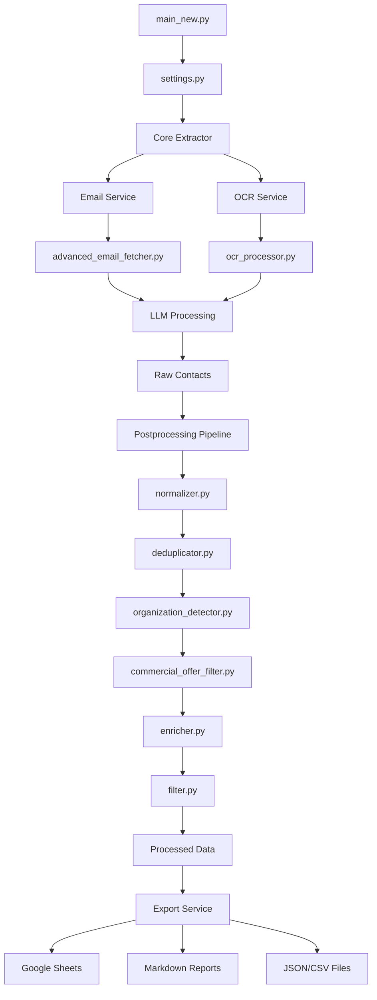
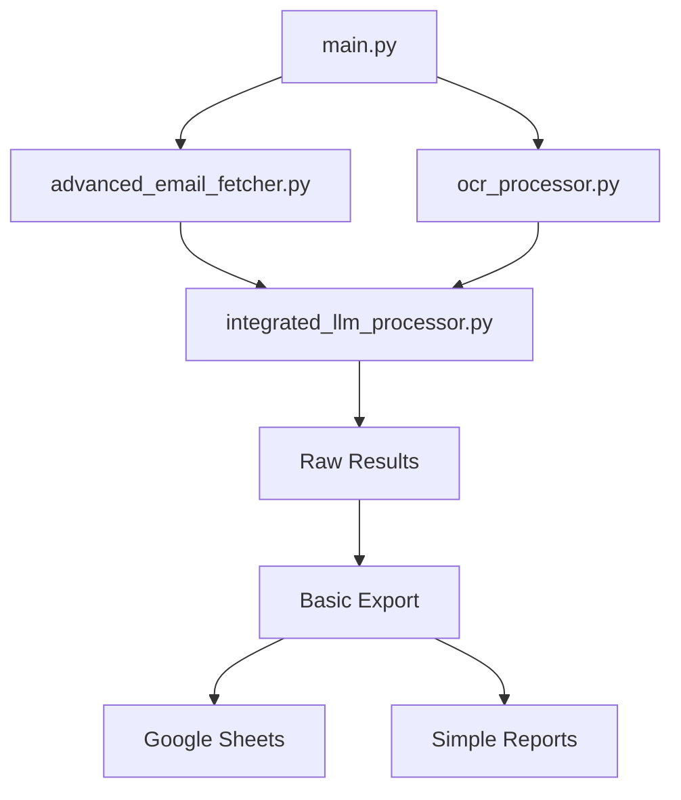
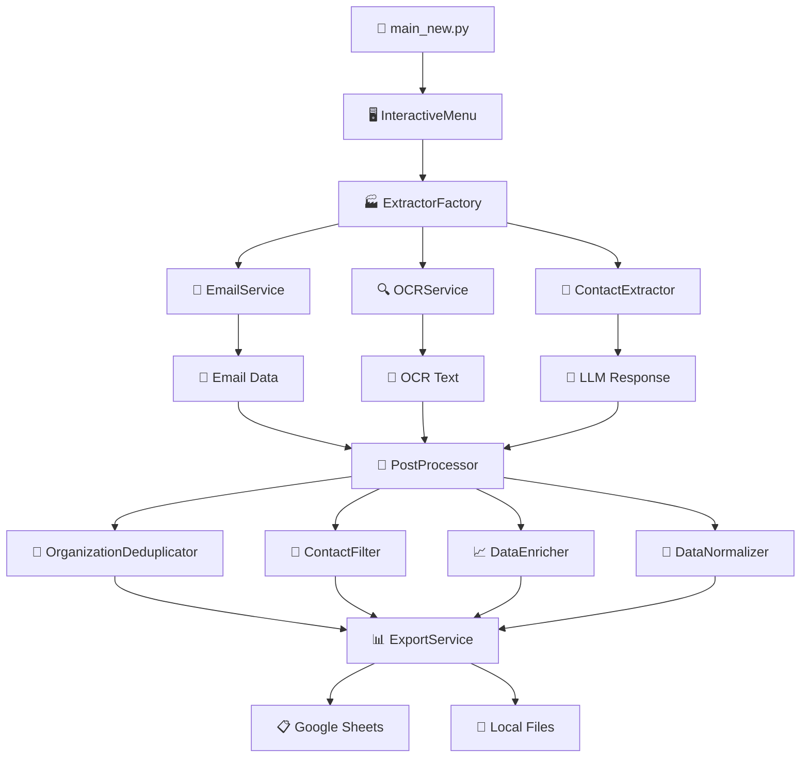
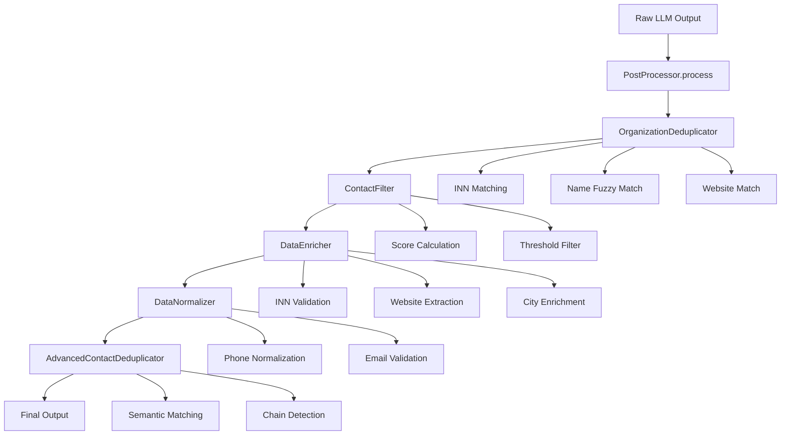

# 🏗️ Архитектурный анализ Contact Parser

**Дата анализа:** 2025-09-13 17:20 
**Версия:** v2.0 (Фаза 5 - Архитектурная оптимизация)  
**Статус:** ✅ Активная разработка с Dependency Injection  

---

## 📋 Обзор проекта

**Contact Parser** — это интеллектуальная система для автоматического извлечения и обработки контактной информации из email-сообщений и их вложений с использованием современных технологий LLM и OCR. После реализации **Фазы 5** система получила слоистую модульную архитектуру с централизованной конфигурацией и продвинутой постобработкой данных.

### 🎯 Основные возможности (Фаза 5)

1. **📧 Автоматическая загрузка писем** с IMAP серверов
2. **🔍 OCR обработка** документов и изображений (PDF, DOC, XLS, изображения)
3. **🤖 LLM анализ** для извлечения контактов и коммерческих предложений
4. **🔧 Постобработка данных** - нормализация, дедупликация, обогащение
5. **🏢 Детекция организаций** и группировка контактов
6. **📊 Экспорт результатов** в Google Sheets с улучшенной структурой
7. **📈 Генерация отчетов** в Markdown формате
8. **🛡️ Интеллектуальная фильтрация** спама и валидация данных
9. **⚙️ Унифицированная конфигурация** всех компонентов системы
10. **🔄 Два режима работы** - legacy (main.py) и новый (main_new.py)

---

## 🏗️ Архитектура системы (Фаза 5)

### Слоистая архитектура:

```
┌─────────────────────────────────────────────────────────────────────────────┐
│                           CONTACT PARSER SYSTEM (Фаза 5)                    │
├─────────────────────────────────────────────────────────────────────────────┤
│  🚀 Entry Points                                                            │
│  ┌─────────────────┐ ┌─────────────────┐ ┌─────────────────────────────────┐ │
│  │ main_new.py     │ │ main.py         │ │ google_sheets_exporter.py       │ │
│  │ (New Pipeline)  │ │ (Legacy)        │ │ (Interactive Menu)              │ │
│  └─────────────────┘ └─────────────────┘ └─────────────────────────────────┘ │
├─────────────────────────────────────────────────────────────────────────────┤
│  ⚙️ Configuration Layer                                                     │
│  ┌─────────────────┐ ┌─────────────────┐ ┌─────────────────┐ ┌─────────────┐ │
│  │ config_manager  │ │ config_validator│ │ provider_manager│ │ regions.py  │ │
│  │     .py         │ │     .py         │ │     .py         │ │             │ │
│  └─────────────────┘ └─────────────────┘ └─────────────────┘ └─────────────┘ │
├─────────────────────────────────────────────────────────────────────────────┤
│  🏗️ Core Layer                                                             │
│  ┌─────────────────┐ ┌─────────────────┐ ┌─────────────────────────────────┐ │
│  │ extractor.py    │ │ validator.py    │ │ extractor_factory.py            │ │
│  └─────────────────┘ └─────────────────┘ └─────────────────────────────────┘ │
├─────────────────────────────────────────────────────────────────────────────┤
│  🔧 Services Layer                                                          │
│  ┌─────────────────┐ ┌─────────────────┐ ┌─────────────────────────────────┐ │
│  │ email_service.py│ │ ocr_service.py  │ │ export_service.py               │ │
│  └─────────────────┘ └─────────────────┘ └─────────────────────────────────┘ │
├─────────────────────────────────────────────────────────────────────────────┤
│  🔄 Postprocessing Layer (NEW!)                                            │
│  ┌─────────────────┐ ┌─────────────────┐ ┌─────────────────────────────────┐ │
│  │ normalizer.py   │ │ deduplicator.py │ │ phone_normalizer.py             │ │
│  └─────────────────┘ └─────────────────┘ └─────────────────────────────────┘ │
├─────────────────────────────────────────────────────────────────────────────┤
│  📁 Legacy Modules (Фаза 12 - в процессе рефакторинга)                     │
│  ┌─────────────────┐ ┌─────────────────┐ ┌─────────────────────────────────┐ │
│  │ advanced_email_ │ │ ocr_processor.py│ │ integrated_llm_processor.py     │ │
│  │ fetcher.py      │ │                 │ │ llm_extractor.py                │ │
│  └─────────────────┘ └─────────────────┘ └─────────────────────────────────┘ │
└─────────────────────────────────────────────────────────────────────────────┘
```

## 🏛️ Новая архитектура (Фаза 5)

### 🚀 Точки входа

#### 1. **main_new.py** - Новый пайплайн с постобработкой
**Функции:**
- Полный цикл обработки с нормализацией данных
- Централизованная конфигурация через settings.py
- Интеграция всех слоев архитектуры
- Поддержка режимов: interactive, batch, validation

#### 2. **main.py** - Legacy пайплайн (без постобработки)
**Функции:**
- Совместимость со старой логикой
- Прямой вызов legacy модулей
- Используется для отладки и сравнения

#### 3. **google_sheets_exporter.py** - Интерактивный оркестратор
**Функции:**
- Интерактивное меню для пользователя
- Выбор режима обработки (legacy/new)
- Экспорт результатов в Google Sheets
- Генерация отчетов и статистики

### 🏗️ Архитектурные слои (детально)

#### 1. **Configuration Layer** (`src/config/`)
- **config_manager.py** - Централизованное управление конфигурацией
- **config_validator.py** - Валидация параметров конфигурации  
- **provider_manager.py** - Управление провайдерами LLM
- **regions.py** - Региональные настройки и данные

#### 2. **Core Layer** (`src/core/`)
- **extractor.py** - Основной экстрактор контактов с LLM
- **extractor_factory.py** - Фабрика для создания экстракторов
- **validator.py** - Валидация LLM ответов и данных
- **contact_enricher.py** - Обогащение контактных данных
- **inn_validator.py** - Валидация ИНН организаций
- **website_extractor.py** - Извлечение информации с веб-сайтов
- **chunker.py** - Разбиение текста на части для обработки
- **cache_manager.py** - Управление кэшированием данных
- **memory_optimizer.py** - Оптимизация использования памяти
- **monitoring.py** - Мониторинг производительности системы
- **validator_backup.py** - Резервный валидатор данных

#### 3. **Services Layer** (`src/services/`)
- **email_service.py** - Сервис для работы с email
- **ocr_service.py** - Сервис OCR обработки
- **export_service.py** - Сервис экспорта данных

#### 4. **Postprocessing Layer** (`src/postprocessing/`) - **НОВОЕ!**
- **Postprocessor.py** - Главный координатор
- **Organization_deduplicator.py** - Дедупликация организаций
- **Contact_filter.py** - Фильтрация контактов
- **Data_enricher.py** - Обогащение данных
- **Data_normalizer.py** - Нормализация данных
- **Advanced_contact_deduplicator.py** - Продвинутая дедупликация

#### 5. **Legacy Modules** (`src/legacy/`) - **Фаза 12**
- **advanced_email_fetcher.py** - В процессе рефакторинга
- **ocr_processor.py** - В процессе рефакторинга
- **integrated_llm_processor.py** - Будет заменен на core/extractor.py
- **llm_extractor.py** - Устаревший модуль

### 🔄 Новый поток данных

```
### 🔄 Новый поток данных (Фаза 5)



### 🔄 Legacy поток данных (main.py)



🚀 main_new.py
    ↓
🖥️ InteractiveMenu (CLI)
    ↓
🏭 ExtractorFactory (DI)
    ↓
📧 EmailService → 🔍 OCRService → 🤖 ContactExtractor → 🔧 PostProcessor → 📊 ExportService
    ↓              ↓               ↓                    ↓                ↓
[IMAP Server] [Google Vision] [OpenAI GPT-4]    [Normalization]  [Google Sheets]
```

---

## 📊 Детальные компоненты (Фаза 5)

### Configuration Layer (`src/config/`)

#### 1. **config_manager.py** - Менеджер конфигурации
**Статус:** ✅ Реализован  
**Функции:**
- Управление настройками системы
- Загрузка конфигурации из различных источников
- Централизованное управление параметрами
- Интеграция с переменными окружения

#### 2. **config_validator.py** - Валидатор конфигурации
**Статус:** ✅ Реализован  
**Функции:**
- Проверка корректности настроек
- Валидация API ключей и подключений
- Предупреждения о потенциальных проблемах
- Проверка целостности конфигурации

#### 3. **provider_manager.py** - Менеджер провайдеров
**Статус:** ✅ Реализован  
**Функции:**
- Управление LLM провайдерами
- Конфигурация подключений к API
- Fallback механизмы между провайдерами
- Rate limiting и мониторинг

#### 4. **regions.py** - Региональные настройки
**Статус:** ✅ Реализован  
**Функции:**
- Настройки для различных регионов
- Локализация параметров обработки
- Региональные форматы данных
- Часовые пояса и локали

### Core Layer (`src/core/`)

#### 1. **extractor.py** - Основной экстрактор
**Статус:** ✅ Реализован  
**Функции:**
- Извлечение контактов через LLM
- Поддержка различных провайдеров
- Обработка email и OCR данных
- Генерация структурированных результатов

#### 2. **extractor_factory.py** - Фабрика экстракторов
**Статус:** ✅ Реализован  
**Функции:**
- Создание экстракторов для различных типов данных
- Управление жизненным циклом экстракторов
- Конфигурация параметров извлечения
- Выбор оптимального экстрактора для задачи

#### 3. **validator.py** - Валидация данных
**Статус:** ✅ Реализован  
**Функции:**
- Валидация LLM ответов
- Проверка структуры данных
- Контроль качества извлечения
- Обработка некорректных результатов

#### 4. **contact_enricher.py** - Обогащение контактов
**Статус:** ✅ Реализован  
**Функции:**
- Дополнение контактной информации
- Поиск дополнительных данных о контактах
- Связывание контактов с организациями
- Улучшение качества данных

#### 5. **inn_validator.py** - Валидатор ИНН
**Статус:** ✅ Реализован  
**Функции:**
- Проверка корректности ИНН
- Валидация контрольных сумм
- Определение типа налогоплательщика
- Проверка существования в базах данных

#### 6. **website_extractor.py** - Извлечение с веб-сайтов
**Статус:** ✅ Реализован  
**Функции:**
- Парсинг веб-страниц для извлечения контактов
- Обработка различных форматов веб-контента
- Извлечение структурированных данных
- Работа с динамическим контентом

#### 7. **chunker.py** - Разбиение на блоки
**Статус:** ✅ Реализован  
**Функции:**
- Разделение больших документов на части
- Оптимизация размера блоков для LLM
- Сохранение контекста между блоками
- Управление перекрытиями

#### 8. **cache_manager.py** - Управление кэшем
**Статус:** ✅ Реализован  
**Функции:**
- Кэширование результатов обработки
- Управление временем жизни кэша
- Оптимизация производительности
- Очистка устаревших данных

#### 9. **memory_optimizer.py** - Оптимизация памяти
**Статус:** ✅ Реализован  
**Функции:**
- Мониторинг использования памяти
- Оптимизация потребления ресурсов
- Управление большими объемами данных
- Предотвращение утечек памяти

#### 10. **monitoring.py** - Мониторинг системы
**Статус:** ✅ Реализован  
**Функции:**
- Отслеживание производительности
- Логирование операций
- Сбор метрик системы
- Уведомления об ошибках


### Services Layer (`src/services/`)

#### 1. **email_service.py** - Email сервис
**Статус:** ✅ Реализован  
**Функции:**
- Обертка над advanced_email_fetcher.py
- Унифицированный интерфейс для email
- Обработка вложений и inline файлов
- Фильтрация и кэширование

#### 2. **ocr_service.py** - OCR сервис
**Статус:** ✅ Реализован  
**Функции:**
- Обертка над ocr_processor.py
- Обработка изображений и PDF
- Извлечение текста из документов
- Оптимизация качества распознавания

#### 3. **export_service.py** - Экспорт данных
**Статус:** ✅ Реализован  
**Функции:**
- Экспорт в Google Sheets, JSON, CSV
- Генерация Markdown отчетов
- Форматирование данных
- Обработка больших объемов

### Postprocessing Layer (`src/postprocessing/`) - **НОВАЯ АРХИТЕКТУРА**

#### 1. **PostProcessor** - Главный координатор
**Статус:** ✅ Реализован (v1.0.0)  
**Функции:**
- Координация всех этапов постобработки
- Последовательное выполнение: дедупликация → фильтрация → обогащение → нормализация
- Сбор статистики и мониторинг
- Обработка ошибок с graceful degradation

#### 2. **OrganizationDeduplicator** - Дедупликация организаций
**Статус:** ✅ Реализован  
**Функции:**
- Fuzzy matching по названию, ИНН, сайту
- Объединение данных (emails, phones, address)
- Создание глобальных ID с автоинкрементом
- Маппинг локальных → глобальных ID

#### 3. **ContactFilter** - Фильтрация контактов
**Статус:** ✅ Реализован  
**Функции:**
- Система баллов: name(+3), organization_id(+2), position(+2), email(+2), phones(+2), city(+1), inn(+1)
- Порог фильтрации: score ≥ 4
- Обновление связанных организаций
- Статистика фильтрации

#### 4. **DataEnricher** - Обогащение данных
**Статус:** ✅ Реализован  
**Функции:**
- Валидация ИНН через core/inn_validator.py
- Извлечение сайтов через core/website_extractor.py
- Обогащение city/address из организаций
- Корпоративная разведка по email доменам

#### 5. **DataNormalizer** - Нормализация данных
**Статус:** ✅ Реализован  
**Функции:**
- Интеграция с phone_normalizer.py
- Нормализация в новый формат phones[]
- Валидация email адресов
- Стандартизация имен и должностей

#### 6. **AdvancedContactDeduplicator** - Продвинутая дедупликация
**Статус:** ✅ Реализован  
**Функции:**
- Семантическое сравнение имен и организаций
- Адаптация к новой структуре phones[]
- Обработка цепочек пересылок
- Fuzzy matching для сложных случаев

### Legacy Modules (`src/legacy/`) - **Фаза 12**

#### 1. **advanced_email_fetcher.py**
**Статус:** 🔄 Интеграция через EmailService  
**Функции:**
- Загрузка писем из различных источников
- Парсинг вложений и inline файлов
- Фильтрация по датам и отправителям
- Будет постепенно рефакторен

#### 2. **ocr_processor.py**
**Статус:** 🔄 Интеграция через OCRService  
**Функции:**
- OCR обработка изображений и PDF
- Извлечение текста из документов
- Оптимизация качества распознавания
- Будет постепенно рефакторен

#### 3. **integrated_llm_processor.py**
**Статус:** 🔄 Замена на core/extractor.py  
**Функции:**
- Устаревший LLM процессор
- Будет заменен новой архитектурой
- Используется только в legacy режиме

---

## 🔄 Взаимосвязи компонентов и пайплайн

### 📊 Полный пайплайн обработки данных



### 🔗 Детальные взаимосвязи

#### 1. **Инициализация системы**
```
main_new.py → ExtractorFactory → UnifiedConfigManager
                              → ProviderManager
                              → PhoneNormalizer
                              → LLMResponseValidator
```

#### 2. **Обработка данных**
```
EmailService → advanced_email_fetcher.py → IMAP Server
OCRService → ocr_processor.py → Google Vision API
ContactExtractor → LLM Providers (OpenRouter/Groq/Replicate)
```

#### 3. **Постобработка (src/postprocessing/)**
```
PostProcessor → OrganizationDeduplicator → Fuzzy matching по названию/ИНН
             → ContactFilter → Система баллов (score ≥ 4)
             → DataEnricher → Валидация ИНН, извлечение сайтов
             → DataNormalizer → Стандартизация форматов
```

#### 4. **Экспорт результатов**
```
ExportService → google_sheets_exporter.py → Google Sheets API
             → google_sheets_bridge.py → Fallback механизмы
             → Local export → CSV/JSON файлы
```

### ⚙️ Конфигурационные зависимости

#### UnifiedConfigManager управляет:
- **LLM провайдеры:** OpenRouter, Groq, Replicate API ключи
- **Google Services:** Vision API, Sheets API credentials
- **Email настройки:** IMAP серверы, аутентификация
- **Rate limits:** Таймауты, retry параметры
- **Постобработка:** Пороги фильтрации, алгоритмы дедупликации

#### ConfigValidator проверяет:
- ✅ Доступность всех API ключей
- ✅ Корректность настроек подключения
- ✅ Валидность конфигурационных параметров
- 🚨 Критические ошибки конфигурации

---

## 📁 Структура данных

### Входные данные:
```
data/
├── emails/
│   └── YYYY-MM-DD/
│       ├── email_001.json
│       ├── email_002.json
│       └── ...
└── attachments/
    └── YYYY-MM-DD/
        ├── document.pdf
        ├── image.png
        └── spreadsheet.xlsx
```

### Промежуточные данные:
```
data/final_results/
├── texts/
│   └── YYYY-MM-DD/
│       ├── ocr_results_001.txt
│       └── ocr_results_002.txt
└── reports/
    └── YYYY-MM-DD/
        └── ocr_summary.json
```

### Выходные данные:
```
data/final_results/
└── llm_analysis/
    └── YYYY-MM-DD/
        ├── analysis_results.json
        ├── contacts_extracted.json
        └── processing_stats.json
```

---

## 🔧 Конфигурация и настройки

### Переменные окружения (.env):
```
# IMAP настройки
IMAP_SERVER=mail.dna-technology.ru
IMAP_PORT=143
IMAP_USER=s.voronova@dna-technology.ru
IMAP_PASSWORD=your-app-password

# Google Sheets
GOOGLE_SPREADSHEET_ID=your-spreadsheet-id

# LLM провайдеры
OPENROUTER_API_KEY=your-openrouter-key
GROQ_API_KEY=your-groq-key
REPLICATE_API_TOKEN=your-replicate-token

# Google Cloud Vision
GOOGLE_APPLICATION_CREDENTIALS=path/to/service-account.json
```

### Ключевые файлы конфигурации:
- `service_account.json` → Google Sheets API
- `prompts/contact_extraction.txt` → Промпт для LLM
- `config/filters/` → Фильтры для писем

---

## 🚀 Сценарии запуска

### 1. Полный цикл обработки:
```bash
python src/google_sheets_exporter.py
# → Интерактивное меню
# → Выбор даты
# → Автоматическая обработка
# → Экспорт в Google Sheets
```

### 2. Только загрузка писем:
```bash
python src/advanced_email_fetcher.py --date 2025-01-24
```

### 3. Только OCR обработка:
```bash
python src/ocr_processor.py
```

### 4. Только LLM анализ:
```bash
python src/integrated_llm_processor.py
```

---

## 📊 Метрики и мониторинг

### Собираемая статистика:
- 📧 Количество обработанных писем
- 📎 Количество обработанных вложений
- 🔍 Успешность OCR распознавания
- 🤖 Успешность LLM извлечения
- ⏱️ Время обработки
- 💰 Стоимость LLM запросов

### Логирование:
- 📝 Детальные логи в `data/logs/`
- 🚨 Обработка ошибок и исключений
- 📊 Статистика по провайдерам

---

## 🛡️ Обработка ошибок

### Механизмы устойчивости:
- 🔄 Retry логика для API запросов
- 🔀 Fallback между LLM провайдерами
- 💾 Сохранение промежуточных результатов
- 🚫 Graceful degradation при ошибках

### Типы ошибок:
- 🌐 Сетевые ошибки (IMAP, API)
- 📄 Ошибки обработки файлов
- 🤖 Ошибки LLM провайдеров
- 📊 Ошибки экспорта в Google Sheets

---

## 🔗 Интеграции и взаимодействия (Фаза 5)

### 1. **Постобработка → Core интеграции**

#### DataEnricher → core/inn_validator.py
```python
# Валидация ИНН организаций
from core.inn_validator import validate_inn
result = validate_inn(organization.inn)
if result.is_valid:
    organization.inn_status = "valid"
    organization.legal_info = result.company_data
```

#### DataEnricher → core/website_extractor.py
```python
# Извлечение сайтов компаний
from core.website_extractor import extract_website
website = extract_website(organization.name, organization.inn)
if website:
    organization.website = website
```

#### DataNormalizer → core/phone_normalizer.py
```python
# Нормализация телефонов в новый формат
from core.phone_normalizer import normalize_phone
normalized = normalize_phone(phone_str)
contact.phones.append({
    "number": normalized.number,
    "type": normalized.type,  # mobile/office
    "formatted": normalized.formatted
})
```

### 2. **Services → Legacy интеграции**

#### EmailService → advanced_email_fetcher.py
```python
# Обертка над legacy модулем
class EmailService:
    def __init__(self):
        self.fetcher = AdvancedEmailFetcher()
    
    def fetch_emails(self, config):
        # Стандартизированный интерфейс
        return self.fetcher.fetch_emails_from_imap(config)
```

#### OCRService → ocr_processor.py
```python
# Обертка над legacy модулем
class OCRService:
    def __init__(self):
        self.processor = OCRProcessor()
    
    def process_file(self, file_path):
        # Унифицированный интерфейс
        return self.processor.process_file(file_path)
```

### 3. **Новая структура данных (Фаза 5)**

#### Входные данные (от Core Extractor)
```json
{
  "contacts": [
    {
      "local_id": "contact_1",
      "name": "Иван Петров",
      "organization_id": "org_1",
      "position": "Директор",
      "email": "ivan@company.ru",
      "phone": "+7 (495) 123-45-67",
      "city": "Москва"
    }
  ],
  "organizations": [
    {
      "local_id": "org_1",
      "name": "ООО Компания",
      "inn": "1234567890",
      "address": "г. Москва, ул. Ленина, 1",
      "emails": ["info@company.ru"],
      "phones": ["+7 (495) 123-45-67"]
    }
  ]
}
```

#### Выходные данные (после Postprocessing)
```json
{
  "contacts": [
    {
      "id": "contact_1",
      "global_organization_id": 1001,
      "name": "Иван Петров",
      "position": "Директор",
      "email": "ivan@company.ru",
      "phones": [
        {
          "number": "+79051234567",
          "type": "mobile",
          "formatted": "+7 (905) 123-45-67"
        }
      ],
      "city": "Москва",
      "score": 12,
      "source": "email_extraction"
    }
  ],
  "organizations": [
    {
      "global_id": 1001,
      "name": "ООО Компания",
      "inn": "1234567890",
      "inn_status": "valid",
      "website": "https://company.ru",
      "address": "г. Москва, ул. Ленина, 1",
      "city": "Москва",
      "emails": ["info@company.ru", "ivan@company.ru"],
      "phones": [
        {
          "number": "+74951234567",
          "type": "office",
          "formatted": "+7 (495) 123-45-67"
        }
      ],
      "contacts_count": 1,
      "merged_from": ["org_1"]
    }
  ],
  "commercial_offers": [
    {
      "id": "offer_1",
      "organization_id": 1001,
      "title": "Поставка оборудования",
      "description": "Коммерческое предложение...",
      "price": 150000.0,
      "currency": "RUB",
      "valid_until": "2024-12-31",
      "source_file": "proposal.pdf"
    }
  ],
  "statistics": {
    "processing_time": 45.2,
    "contacts_processed": 150,
    "contacts_filtered": 120,
    "organizations_deduplicated": 45,
    "organizations_enriched": 38,
    "phones_normalized": 89
  }
}
```

### 4. **Цепочка обработки данных**



---

## 🔮 Возможности расширения (Фаза 5+)

### 1. **Расширение Postprocessing Pipeline**

#### Новые компоненты (Фаза 6)
- **IndustryClassifier** - автоматическое определение отраслей
- **ConversionPredictor** - ML-модель для оценки качества лидов
- **SentimentAnalyzer** - анализ тональности коммерческих предложений
- **CompetitorDetector** - выявление конкурентов в данных

#### Улучшения существующих компонентов
- **OrganizationDeduplicator**: добавление ML-модели для семантического сравнения
- **DataEnricher**: интеграция с СПАРК API, Контур.Фокус
- **ContactFilter**: динамические пороги на основе исторических данных

### 2. **Новые провайдеры LLM (Фаза 7)**

#### Поддержка новых моделей
```python
# Расширение ExtractorFactory
class ExtractorFactory:
    SUPPORTED_PROVIDERS = {
        'openai': OpenAIExtractor,
        'anthropic': ClaudeExtractor,  # NEW
        'google': GeminiExtractor,     # NEW
        'local': LocalLLMExtractor,    # NEW
        'yandex': YandexGPTExtractor   # NEW
    }
```

#### Автоматический выбор провайдера
- A/B тестирование качества извлечения
- Балансировка нагрузки между провайдерами
- Fallback механизмы при недоступности

### 3. **Интеграции с внешними сервисами (Фаза 8)**

#### CRM интеграции
```python
# Новый ExportService для CRM
class CRMExportService:
    def export_to_bitrix24(self, contacts, organizations)
    def export_to_amocrm(self, contacts, organizations)
    def export_to_pipedrive(self, contacts, organizations)
```

#### Обогащение данных
- **СПАРК API** - финансовые данные компаний
- **Контур.Фокус** - реквизиты и связи
- **LinkedIn API** - профили сотрудников
- **Telegram Bot API** - поиск контактов

### 4. **Масштабирование и производительность (Фаза 9)**

#### Распределенная обработка
```python
# Celery интеграция
from celery import Celery

@app.task
def process_email_batch(email_batch):
    return PostProcessor().process(email_batch)

@app.task
def enrich_organizations(org_batch):
    return DataEnricher().enrich_batch(org_batch)
```

#### Кэширование и оптимизация
- **Redis** для кэширования LLM ответов
- **PostgreSQL** для хранения обработанных данных
- **Elasticsearch** для полнотекстового поиска
- **MinIO** для хранения файлов

### 5. **Мониторинг и аналитика (Фаза 10)**

#### Система метрик
```python
# Prometheus метрики
from prometheus_client import Counter, Histogram

contacts_processed = Counter('contacts_processed_total')
processing_time = Histogram('processing_time_seconds')
llm_requests = Counter('llm_requests_total', ['provider', 'status'])
```

#### Дашборды и алерты
- **Grafana** дашборды для мониторинга
- **AlertManager** для критических ошибок
- **ELK Stack** для логирования и анализа

### 6. **API и веб-интерфейс (Фаза 11)**

#### REST API
```python
# FastAPI интерфейс
from fastapi import FastAPI

app = FastAPI()

@app.post("/api/v1/extract")
async def extract_contacts(files: List[UploadFile]):
    return await ContactExtractor().process_files(files)

@app.get("/api/v1/organizations/{org_id}")
async def get_organization(org_id: int):
    return await OrganizationService().get_by_id(org_id)
```

#### Веб-интерфейс
- **React** фронтенд для управления
- **WebSocket** для real-time обновлений
- **File upload** с drag&drop
- **Результаты** с фильтрацией и экспортом

### 7. **Безопасность и соответствие (Фаза 12)**

#### Защита данных
- **Шифрование** персональных данных
- **GDPR** соответствие для обработки ПД
- **Аудит логи** всех операций
- **Role-based access** для пользователей

#### Валидация и очистка
- **Автоматическое удаление** устаревших данных
- **Анонимизация** для тестовых сред
- **Backup и recovery** процедуры

---

## 📋 Выводы и рекомендации (Фаза 5)

### ✅ **Достижения текущей фазы**

1. **Успешная реализация Postprocessing Pipeline**
   - Все 6 компонентов постобработки работают стабильно
   - Новая структура данных с phones[] массивами
   - Интеграция с core модулями (inn_validator, website_extractor, phone_normalizer)

2. **Архитектурные улучшения**
   - Четкое разделение на слои: Configuration → Core → Services → Postprocessing
   - Унифицированные интерфейсы через Services Layer
   - Graceful degradation при ошибках

3. **Качество данных**
   - Система баллов для фильтрации контактов (порог ≥ 4)
   - Дедупликация организаций по ИНН, названию, сайту
   - Обогащение данных через внешние API
   - Нормализация телефонов в стандартный формат

### 🎯 **Приоритетные задачи (Фаза 6)**

1. **Экспорт commercial_offers** (Высокий приоритет)
   - Адаптация google_sheets_exporter.py под новую структуру
   - Создание отдельных листов для КП
   - Валидация данных перед экспортом

2. **Обновление отчетов** (Высокий приоритет)
   - Адаптация .md генерации под новые поля
   - Добавление секций для организаций и КП
   - Сводная статистика по типам данных

3. **Мониторинг и логирование** (Средний приоритет)
   - Детальные логи каждого этапа постобработки
   - Метрики производительности
   - Алерты при критических ошибках

### 🔧 **Технические рекомендации**

1. **Производительность**
   - Рассмотреть асинхронную обработку для больших объемов
   - Кэширование результатов валидации ИНН
   - Батчевая обработка для внешних API

2. **Надежность**
   - Добавить retry логику для внешних сервисов
   - Улучшить обработку edge cases в дедупликации
   - Backup механизмы для критических данных

3. **Расширяемость**
   - Подготовить архитектуру для ML компонентов (Фаза 7)
   - Создать plugin систему для новых обогатителей
   - API для интеграции с внешними системами

### 📊 **Метрики успеха**

- **Качество данных:** 95%+ контактов проходят валидацию
- **Дедупликация:** 80%+ дублей организаций успешно объединяются
- **Производительность:** <60 секунд на обработку 100 контактов
- **Надежность:** 99%+ uptime для критических компонентов

### 🚀 **Долгосрочная стратегия**

1. **Фазы 6-8:** Интеграции и автоматизация
2. **Фазы 9-10:** Масштабирование и мониторинг
3. **Фазы 11-12:** API, веб-интерфейс, безопасность

Текущая архитектура обеспечивает прочную основу для всех планируемых расширений.

---

**Конец отчета**